```shell
Java:
	stream

centOS: 7
mysql: 5.7
redis: 

阿里云子用户
gulimall gulimall
access-key: LTAI5tD6dTxvDiNPyxMqvQMs
secret-key: oIaVClnxVmromcsMnGyxatqqwfWUyP

接口文档
https://easydoc.net/s/78237135/ZUqEdvA4/hKJTcbfd
```


# 项目背景

## 项目前置知识


## 分布式概念

### 微服务

### 集群&分布式&结点

### 远程调用

### 负载均衡

### 服务注册/发现 & 注册中心

### 配置中心

### 服务熔断和降级

### API网关


## 项目架构图


- B2C模式(Business to Costumer)

## 微服务划分图


# 环境搭建

##  安装virtualBox

- 官网安装(傻瓜操作)

### 使用vagrant 虚拟linux

- vagrant 官方镜像仓库
  - https://app.vagrantup.com/boxes/search  

- 下载安装 vagrant(windows 64x) 

  - https://www.vagrantup.com/downloads

- 验证vagrant是否安装成功

  - 命令行输入 vagrant 出现提示说明安装成功
  - 

- 利用vagrant初始化 Linux系统

  - 根据vagrant 镜像仓库的提示 

  - 

  - ```shell
    #1. 命令行输入 
    vagrant init centos/7
    
    D:\Tools\Environment\Vagrant_CentOS7_GuliMall>vagrant init centos/7
    A `Vagrantfile` has been placed in this directory. You are now
    ready to `vagrant up` your first virtual environment! Please read
    the comments in the Vagrantfile as well as documentation on
    `vagrantup.com` for more information on using Vagrant.
    
    #2. 下载镜像 配置虚拟机 
    vagrant up
    
    #3. 连接上虚拟机
    vagrant ssh
    
    #4. 查看基本信息
    whoami
    ls /
    
    #5. 退出虚拟机的链接
    exit
    
    #6. 关闭虚拟机
    virtualBox 右键虚拟机 -> 正常关机
    
    #7. 重启虚拟机
    #方式一
    virtualBox 右击 启动 -> 正常启动
    #方式二
    #在包含VagrantFile的文件夹下cmd窗口输入
    vagrant up
    #重新连接虚拟机
    vagrant ssh
    
    #8. 切换到root用户
    #密码为 vagrant
    su root
    
    
    ```

  - 

  - 

  - 

  - 

  - 

## 网络地址转换-端口转发


- 默认的端口转发的方式, 我们每在虚拟机安装一个软件都需要设置一个端口映射
  - 如安装了MySQL, 需要将主机的3333端口映射到虚拟机的3306端口, 这样用户通过访问我们主机的3333端口就可以访问虚拟机的3306端口, 但是每安装一个新的的软件都需要做这样的映射
  - 

- 希望给虚拟机一个固定的 ip 地址, 这样可以通过ip 和window宿主机Ping通

```shell
#打开VagrantFile 找到虚拟机ip地址的配置

#需要思考给虚拟机分配的ip地址如何分配

#在主机上cmd窗口 输入 
ipconfig

#找到VirtualBox的网络地址 为 192.168.56.1

#需要给虚拟机设置的ip地址就必须为 192.168.56.开头 这里设置为 192.168.56.10

#然后重启vagrant 
vagrant reload

#连接vagrant
vagrant ssh

#测试虚拟机与主机是否连通, 打开一个cmd窗口
ipconfig
# window ip地址为 192.168.0.104
# 虚拟机ip地址为 192.168.56.10
#尝试互相ping是否连通
# windows -> vm
ping 192.168.56.10
# vm -> windows
ping 192.168.0.104
```

- 查看VagrantFile的默认网路ip


- 查看VirtualBox的网络ip	


- 修改虚拟机的 ip为VirtualBox一个局域网下的子网


- 查看主机的 ip


- 测试 windows --ping--> VM


- 测试 VM--ping--> Wondows


- 配置虚拟机的 固定 ip成功


## 安装Docker

- Docker Hub 镜像仓库
  - 可以从镜像仓库拉取镜像直接运行即可
  - https://hub.docker.com/
- Docker 官网
  - https://docs.docker.com/engine/install/centos/
  - 选择Linux-->CentOS对应的安装方法

```shell
#1. 卸载旧版本的docker
#当前的用户是 vargant
#需要root用户执行 命令前面加上 sudo
sudo yum remove docker \
                  docker-client \
                  docker-client-latest \
                  docker-common \
                  docker-latest \
                  docker-latest-logrotate \
                  docker-logrotate \
                  docker-engine
#2. 通过仓库安装
sudo yum install -y yum-utils

#3. 设置镜像的仓库
sudo yum-config-manager \
    --add-repo \
    https://download.docker.com/linux/centos/docker-ce.repo #默认的是国外的
sudo yum-config-manager \
    --add-repo \
	http://mirrors.aliyun.com/docker-ce/linux/centos/docker-ce.repo #阿里云的镜像

#4. 安装docker相关的内容 docker-ce社区的版本, ee企业版
sudo yum install docker-ce docker-ce-cli containerd.io

#5. 启动docker
 sudo systemctl start docker
 
#5. 查看是否启动成功
#查看版本
docker -v
#查看所有镜像
sudo docker images

#6. 设置docker开机自启动
sudo systemctl enable docker


```


- 卸载docker


- docker下载成功


- docker配置镜像仓库(阿里与)


- docker 安装成功


### 配置docker阿里云镜像仓库

```shell
#阿里云镜像仓库, 配置镜像加速
sudo mkdir -p /etc/docker
sudo tee /etc/docker/daemon.json <<-'EOF'
{
  "registry-mirrors": ["https://iqdfatk7.mirror.aliyuncs.com"]
}
EOF
sudo systemctl daemon-reload
sudo systemctl restart docker
```


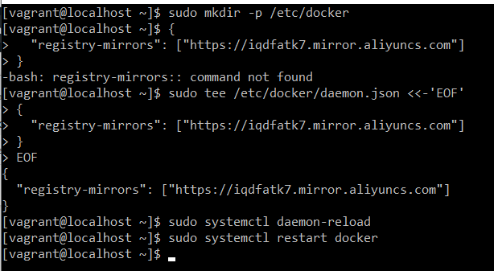


## Docker安装 MySQL (5.7)

```shell
#1. 从镜像仓库拉取mysql镜像, 不指定版本默认下载最新的, 指定版本 mysql:版本号(docker hub上找)
docker pull mysql:5.7
#2. 启动 mysql镜像创建容器
# --name指定容器名字 
#-v目录挂载 
#Linux目录		     mysql内部目录
/mydata/mysql/log:   /var/log/mysql 
/mydata/mysql/data:  /var/lib/mysql 
/mydata/mysql/conf:  /etc/mysql 
#-p指定端口映射 linux端口:mysql端口 [3306:3306]
#-e设置mysql参数 
#-d后台运行
sudo docker run -p 3306:3306 --name mysql \
-v /mydata/mysql/log:/var/log/mysql \
-v /mydata/mysql/data:/var/lib/mysql \
-v /mydata/mysql/conf:/etc/mysql \
-e MYSQL_ROOT_PASSWORD=root \
-d mysql:5.7

#3. 查看运行的容器
docker ps

#4. sqlyog测试连接创建的mysql容器
ip:192.168.56.10
用户名:root
密码:root
端口:3306

#5. 运行mysql容器
docker exec -it mysql[容器id | 容器别名] /bin/bash

[root@localhost vagrant]# docker exec -it 7dce2007281c /bin/bash
root@7dce2007281c:/# ls /
bin  boot  dev  docker-entrypoint-initdb.d  entrypoint.sh  etc  home  lib  lib64  media  mnt  opt  proc  root  run  sbin  srv  sys  tmp  usr  var
root@7dce2007281c:/# whereis mysql
mysql: /usr/bin/mysql /usr/lib/mysql /etc/mysql /usr/share/mysql

#6, 修改配置文件
#在 /mydata/mysql/conf 目录下修改配置文件
vi my.conf

#在my.conf中粘贴一下内容
[client]
default-character-set=utf8
[mysql]
default-character-set=utf8
[mysqld]
init_connect='SET collation_connection = utf8_unicode_ci'
init_connect='SET NAMES utf8'
character-set-server=utf8
collation-server=utf8_unicode_ci
skip-character-set-client-handshake
skip-name-resolve

#7. 重启mysql
[root@localhost conf]# docker restart mysql
mysql

#进入mysql容器
[root@localhost conf]# docker exec -it mysql /bin/bash
#进入配置文件的目录
root@7dce2007281c:/# cd /etc/mysql
root@7dce2007281c:/etc/mysql# ls
my.conf
#查看挂载的配置文件内容, 外部linux配置的配置文件被挂载到了mysql内部指定的目录下了
root@7dce2007281c:/etc/mysql# cat my.conf
[client]
default-character-set=utf8

[mysql]
default-character-set=utf8

[mysqld]
init_connect='SET collation_connection = utf8_unicode_ci'
init_connect='SET NAMES utf8'
character-set-server=utf8
collation-server=utf8_unicode_ci
skip-character-set-client-handshake
skip-name-resolve
```


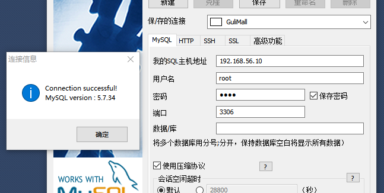

- Docker容器文件挂载与端口映射


## 安装redis

```shell
#1. 下载redis镜像
docker pull redis
 
#2. 运行下载的redis镜像
# 如果直接挂载的话docker会以为挂载的是一个目录，所以我们先创建一个文件然后再挂载，在虚拟机中。
# 在虚拟机中
mkdir -p /mydata/redis/conf
touch /mydata/redis/conf/redis.conf

docker run -p 6379:6379 --name redis \
-v /mydata/redis/data:/data \
-v /mydata/redis/conf/redis.conf:/etc/redis/redis.conf \
-d redis redis-server /etc/redis/redis.conf
#进入redis客户端
docker exec -it redis redis-cli
```

- 默认是不持久化的。在配置文件中输入appendonly yes，就可以aof持久化了。修改完docker restart redis，docker -it redis redis-cli

```shell
vim /mydata/redis/conf/redis.conf
# 插入下面内容
appendonly yes

#更新配置文件后 重启redis
docker restart redis

#存入值以后, 就会持久化,第二次进入redis容器 先前存放的值就不会删除了

#最后设置 mysql redis 启动的时候自动开启
[root@localhost vagrant]# docker update redis --restart=always
redis
[root@localhost vagrant]# docker update mysql --restart=always
mysql
```

- 下载 Redis Desktop Manager


- redis官网
  - https://redis.io/documentation
  - 查询配置文件
  - https://raw.githubusercontent.com/redis/redis/6.0/redis.conf


## 统一开发环境

- java 1.8
- maven 3.6.1

```shell
#配置maven阿里云镜像
<mirrors>
    <mirror>
      <id>nexus-aliyun</id>
      <mirrorOf>central</mirrorOf>
      <name>Nexus aliyun</name>
      <url>http://my.repository.com/repo/path</url>
    </mirror>
</mirrors>
#配置jdk版本
<profiles>
	<profile>
      <id>jdk-1.8</id>
      <activation>
        <activeByDefault>true</activeByDefault>
        <jdk>1.8</jdk>
      </activation>
      <properties>
        <maven.compiler.source>1.8</maven.compiler.source>
        <maven.compiler.target>1.8</maven.compiler.target>
        <maven.compiler.compilerVersion>1.8</maven.compiler.compilerVersion>
      </properties>
	</profile>
</profiles>
#本地仓库位置
<localRepository>D:/Tools/mavenRepository</localRepository>
```

- IDEA
  - 修改maven在IDEA的配置


- 安装lombok插件

- 安装MybatisX插件

- VSC插件

- Git客户端

  - 配置 name email

  - ssh免密连接

  - ```shell
    #Generate a ssh key
    ssh-keygen -t rsa -C "chengchaoqun@hotmail.com"
    #copy the key into github, add new SSH key
    cat ~/.ssh/id_rsa.pub
    #确认
    $ ssh -T git@github.com
    Hi cchaoqun! You've successfully authenticated, but GitHub does not provide shell access.
    
    ```

- 配置Github仓库


## 创建项目

1. New Project from version Control

   1. 复制仓库地址

2. 新建模块

   1. 商品服务
   2. 仓储服务
   3. 订单服务
   4. 优惠券服务
   5. 用户服务

3. 共同点

   1. srping-web  Routing -> OpenFeign

   2. 包名  com.atguigu.gulimall.xxx(product/order/ware/coupon/member)

   3. 模块名: gulimall-coupon

   4. ```shell
      com.atguigu.gulimall
      gulimall-
      gulimall
      
      ```

4. 设置忽略文件并提交到远程仓库

   1. ```shell
      **/mvnw
      **/mvnw.cmd
      **/.mvn
      **/.gitignore
      .idea
      **/target/
      ```

   2. Default Changelist --> add to VSC --> Commit file -->commit and push


## 创建数据库

1. 连接虚拟机中的数据库
2. 创建数据库
3. 根据sql文件创建各个数据库各自的表


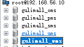


## 人人开源脚手架

- https://gitee.com/renrenio
- clone开源的前后端分离的后台系统工程
  - renren-fast
    - 放入我们的项目, 父项目的木块中加入该模块
    - 将db文件夹中的mysql.sql创建对应的gulimall_admin数据库, 利用其中的sql脚本创建对应的表
  - renren-fast-vue
    - 使用VSC

### 配置后台数据库的配置文件

1. 修改application-dev的数据库配置文件,
   1. ip: 192.168.56.10
   2. 数据库: gulimall
   3. username: root
   4. password: root
2. 配置模块的SDK
3. 启动程序
4. 访问
   1. http://localhost:8080/renren-fast/
   2. 

### 配置前端

- 下载安装Node.js (10.24.x)
  - https://nodejs.org/zh-cn/

```shell
#查看node版本
node -v
#配置npm使用淘宝镜像
npm config set registry http://registry.npm.taobao.org/
#重启VSC后, 终端输入npm install 下载依赖
npm install
#运行
npm run dev
#运行成功, 打开8001端口即可打开项目
http://localhost:8001
# I  Your application is running here: http://localhost:8001

#测试登录
username: admin
password: admin
```

- 点击验证码, 后台程序会对应发送验证码


- 联调通过


### 为Product模块配置逆向工程, 生成DAO层文件

- https://gitee.com/renrenio/renren-generator?_from=gitee_search
- git clone 仓库到本地
- 导入到我们的项目中
- 添加到模块中
- 修改
  - application.yml数据库连接的参数
    - 为每个数据都生成对应的数据库相关代码
    - ip: 192.168.56.10
    - 数据库名: gulimall_pms(还有剩余的4个)
    - username: root
    - password: root
    - 
  - generator.properties
    - 主路径
    - 包名
    - 模块名
    - 作者
    - 邮箱
    - 表前缀, 如 gulimall_pms数据库中的表前缀全部为pms_
    - 
  - 运行
    - http://localhost:80/
    - 
    - 
  - 勾选全部的表, 生成代码,打开(这里注意调整一页30, 这样全部的表才会被勾选)
    - 生成了SQL文件
      - 
    - main.resource.mapper.product中有DAO对应的xml文件
      - 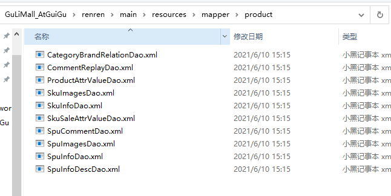
    - 按照我们之前在generator.properties文件中指定的类路径包名和模块名, 生成了对应的dao.entity service controller类
      - 
    - 将生成的main文件粘贴到对应木块的文件夹, 替换掉我们微服务模块的main文件夹, 这样我们就不要手写Dao层对应的代码了
      - 覆盖后, 模块的目录
      - 

### 配置工具类模块

但是生成的代码中存在很多MyBatis-Plus, Shiro, 等工具类的依赖,我们需要在父项目创建一个模块为这些依赖提供服务

- 创建工具类模块 gulimall-common
  - 
- 在其他子模块下引入该模块的依赖
  - 
- gulimall-common模块会创建公共的一些工具类 bean等

#### Mybatis-plus

https://mp.baomidou.com/guide/install.html#release

```xml
<dependency>
    <groupId>com.baomidou</groupId>
    <artifactId>mybatis-plus-boot-starter</artifactId>
    <version>3.2.0</version>
</dependency>
```

#### lombok

- 实体类的get set 方法 通过lombok的 @Data注解生成

```xml
<!--lombok-->
<dependency>
    <groupId>org.projectlombok</groupId>
    <artifactId>lombok</artifactId>
    <version>1.18.8</version>
</dependency>
```

#### 工具类


- service包下的impl类缺少对应的工具类依赖
- 我们在gulimall-common模块下创建对应的路径, 将需要的工具类从renren-fast模块下拿过来即可
  - 创建对应目录
  - 
  - 从renren-fast粘贴对应工具类 PageUtils Query R
  - 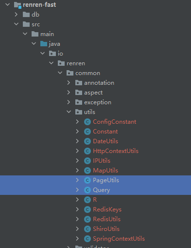

##### R类的依赖导入

- 从renren-fast中引入的R类, 依赖了 HttpComponents组件, 需要Maven仓库中的依赖导入到模块
  - 

  - ```xml
    <!-- https://mvnrepository.com/artifact/org.apache.httpcomponents/httpcore -->
    <dependency>	
        <groupId>org.apache.httpcomponents</groupId>
        <artifactId>httpcore</artifactId>
        <version>4.4.12</version>
    </dependency>
    
    ```

##### Query类的依赖

- commons.lang.StringUtils在renren-fast的pom文件中可以找到

  - 对应的版本号是2.6

  - 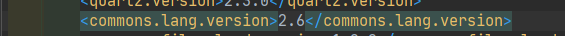

  - ```xml
    <!--Query类依赖的commons.lang.StringUtils-->
    <dependency>
        <groupId>commons-lang</groupId>
        <artifactId>commons-lang</artifactId>
        <version>2.6</version>
    </dependency>
    ```

- SQLFilter是renren开源自己写的工具类

  - 将对应所在的xss包全部拿过来复制到我们的commons包下
  - 更改Query类中SQLFilter的引用为我们自己模块下复制过来的

- Constant类也在renren-fast utils包中, 复制过来

- 

#### controller的@RequiresPermissions

- 这是Shiro的注解, 我们后面会使用Spring Security 这里可以先删除
- 我们需要调整教授叫renren-generator不生这个注解]
- 逆向工程的核心是template包下的这些模板
  - 
- 将Controller文件中@RequiresPermissions注解注释掉
  - 
- 删除这个注解的引用
  - 


#### 其他依赖

- xss包下的类需要servlet依赖

```xml
<!--servlet
Tomcat中带有servlet, scope改成provided打包的时候不会带上这个依赖
-->
<dependency>
    <groupId>javax.servlet</groupId>
    <artifactId>servlet-api</artifactId>
    <version>2.5</version>
    <scope>provided</scope>
</dependency>
```

- 删除
  - 这些类中带有防止脚本攻击的依赖MediaType 后面使用SpringSecurity暂时删掉这些类
  - XssFilter
  - XssHttpServletRequestWrapper
- SQLFilter
  - renren-fast中找到RRException复制到utils包下, 重新导入依赖即可

#### 重启逆向工程renren-generator 重新生成

- 将生成的文件中的main替换对应模块下的main
- 再次查看Controller类, 里面的@RequiresPermissions注解已经被注释掉了


#### 结束所有的DAO生成的方法的调整

### 测试逆向工程生成的文件

#### 整合Mybatis-Plus

生成的文件依赖了Mybatis-Plus, 需要整合Mybatis-Plus

1. 导入依赖

   1. ```xml
      <dependency>
          <groupId>com.baomidou</groupId>
          <artifactId>mybatis-plus-boot-starter</artifactId>
          <version>3.2.0</version>
      </dependency>
      ```

2. 配置

   1. 配置数据源

      1. 导入MySQL数据库驱动

         1. 查看MySQL数据库的信息

         2. 

         3. 导入对应版本的MySQL的驱动

            1. Maven没有对对应完全一致的版本, 查看MySQL官方的解释

            2. 

            3. 5.1 8.0都支持了5.7, 推荐使用8.0

            4. 最终选择8.0.17

            5. ```xml
               <!-- https://mvnrepository.com/artifact/mysql/mysql-connector-java -->
               <dependency>
                   <groupId>mysql</groupId>
                   <artifactId>mysql-connector-java</artifactId>
                   <version>8.0.17</version>
               </dependency>
               
               ```

      2. gulimall-product模块下创建application.yml配置数据源

         1. ```yml
            spring:
              datasource:
                username: root
                password: root
                url: jdbc:mysql://192.168.56.10:3306/gulimall_pms?useUnicode=true&characterEncoding=UTF-8&serverTimezone=Asia/Shanghai
                driver-class-name: com.mysql.cj.jdbc.Driver
            ```

   2. 配置mybatis-plus

      1. 使用@MapperScan告诉Mybatis-plus Mapper接口的位置

         1. 

      2. 告诉Mybatis-plus映射文件位置

         1. 在application.yml文件中配置

         2. ```yml
            mybatis-plus:
              mapper-locations: classpath:/mapper/**/*.xml #扫描类路径下的 mapper文件夹下的所有文件夹中的xml文件
            ```

      3. 配置主键自增

         1. entitye目录下的实体类, @TableId表示是主键

            1. 

         2. 但是点进去发现默认不是自增的  IdType>NONE

            1. 

         3. 点进IdType发现又自增的选项, AUTO

            1. 

         4. 我们在配置文件中配置主键自增

            1. id-type: auto

            2. ```yml
               mybatis-plus:
                 mapper-locations: classpath:/mapper/**/*.xml #扫描类路径下的 mapper文件夹下的所有文件夹中的xml文件
                 global-config:
                   db-config:
                     id-type: auto
               ```

      4. 测试

         1. gulimall-product test类测试

         2. ```java
            @SpringBootTest
            class GulimallProductApplicationTests {
                @Autowired
                private BrandService brandService;
                @Test
                void contextLoads() {
                    BrandEntity brandEntity = new BrandEntity();
                    //添加
            //        brandEntity.setName("华为");
            //        brandService.save(brandEntity);
            
                    //根据id修改
            //        brandEntity.setBrandId(2L); //这里因为第一添加配置文件没有设置编码格式, 设置后删除了第一次的数据重新插入所以是2(Long)
            //        brandEntity.setDescript("华为");
            //        brandService.updateById(brandEntity);
            
                   //查询
                    /*
                    QueryWrapper 查询条件
                        泛型是想要查询出来的类
                    .eq 表示哪一列等于什么值的结果
                     */
                    List<BrandEntity> list = brandService.list(new QueryWrapper<BrandEntity>().eq("brand_id", 2L));
                    //输出集合中的元素
                    list.forEach((item)->{
                        System.out.println(item);
                    });
            //        System.out.println("保存成功...");
            
                }
            }
            ```

            

         3. 测试结果

            1. 增
               1. 控制台输出信息
                  1. 
               2. 查看数据库
                  1. 
            2. 更新
               1. 
            3. 查询
               1. 控制台输出
                  1. 


### 为其他模块生成逆向工程代码

1. 修改renren-generator generator.properties配置文件
   1. 模块
   2. 表前缀
   3. 
2.  application.yml
   1. 数据源连接的数据库
   2. 
3. 运行
4. 访问80端口
   1. 选中所有的表, 点击生成代码
5. 解压下载下来的压缩包
6. 将main文件夹复制到对应模块, 覆盖原本的main文件夹
7. 在对应模块的pom.xml引入公共模块(guli-common)的依赖, 这样这些lombok, mybatis-plus等的依赖就都被引入了
8. resource目录下新建 application.yml(从之前写好的product模块复制过来修改数据库名字即可) 配置数据源地址
9. 运行主程序
10. 测试
    1. 访问某个controller指定的访问路径
    2. 
    3. 访问 http://localhost:8080/coupon/coupon/list
    4. 

#### 为所有微服务配置端口号

```yml
server:
	port:
#coupon: 7000
#member: 8000
#order: 9000
#product: 10000
#ware: 11000
```

- 所有微服务测试全部通过


# 微服务环境搭建


## SpringCloud-Alibaba

https://spring.io/projects/spring-cloud-alibaba

https://github.com/alibaba/spring-cloud-alibaba/blob/master/README-zh.md

### 引入依赖

- 在gulimall-common里面引入SpringCloud-Alibaba的依赖 2.1.0
- 因为其他的微服务模块都引用了gulimall-common

```xml
<dependencyManagement>
    <dependencies>
        <dependency>
            <groupId>com.alibaba.cloud</groupId>
            <artifactId>spring-cloud-alibaba-dependencies</artifactId>
            <version>2.1.0.RELEASE</version>
            <type>pom</type>
            <scope>import</scope>
        </dependency>
    </dependencies>
</dependencyManagement>
```

## Nacos 注册中心

https://github.com/alibaba/spring-cloud-alibaba/blob/master/spring-cloud-alibaba-examples/nacos-example/nacos-discovery-example/readme-zh.md

### 导入Nacos依赖到common模块

```xml
 <dependency>
     <groupId>com.alibaba.cloud</groupId>
     <artifactId>spring-cloud-starter-alibaba-nacos-discovery</artifactId>
 </dependency>
```

### 下载Nacos Server

https://github.com/alibaba/nacos/releases/tag/1.1.3

- 我们希望把微服务注册到注册中心首先需要有一个Nacos 服务器, 
- 下载和视频一致的 1.1.3 版本的Nacos Server
- 解压后打开bin目录下的startup.cmd 就开启了 NacosServer 
  - 

### 在应用的配置文件中配置 Nacos Server 地址

```yml
  cloud:
    nacos:
      discovery:
        server-addr: 127.0.0.1:8848
```

### 使用 @EnableDiscoveryClient 注解开启服务注册与发现功能

```java
//注册服务到注册中心
@EnableDiscoveryClient
@SpringBootApplication
public class GulimallCouponApplication {
    public static void main(String[] args) {
        SpringApplication.run(GulimallCouponApplication.class, args);
    }
}
```

### 启动服务

- 启动服务之前需要先启动Nacos Server, 

### 访问Nacos

http://127.0.0.1:8848/nacos

- username: nacos
- password: nacos


- 暂时显示没有服务, 因为还没有为服务配置名称


### 为每个微服务配置服务的名称

- 配置了服务的名称, 在注册中心中就可以看到每个服务

```yml
application:
    name: gulimall-coupon
```


### 微服务注册到注册中心的步骤

1. 配置文件中配置Nacos server的地址

2. 配置微服务的应用名称

3. 在主应用程序上加上 @EnableDiscoveryClient注解

4. 启动NacosServer服务器

5. 启动微服务

6. 登录 127.0.0.1:8848/nacos

   

### 测试微服务间的调用

- member 服务调用 coupon

#### 引入OpenFeign依赖

```xml
<dependency>
    <groupId>org.springframework.cloud</groupId>
    <artifactId>spring-cloud-starter-openfeign</artifactId>
</dependency>
```

#### coupon中加入获取用户优惠券的方法

- CouponController

```java
/**
 * 返回用户优惠券信息
 */
@RequestMapping("/member/list")
public R membercoupons(){
    CouponEntity couponEntity = new CouponEntity();
    couponEntity.setCouponName("满100减10");
    //R继承了HashMap
    return R.ok().put("coupons", Arrays.asList(couponEntity));
}
```

#### member模块添加feign包

#### feign包中编写接口, 告诉SpringCloud这个接口需要调用远程服务

- 要调用微服务 gulimall-coupon 的 这个请求url  /coupon/coupon/member/list 映射下的方法

```java
@FeignClient("gulimall-coupon")//参数为要调用的服务名称(注册中心服务的名称)
public interface CouponFeignService {
    //服务有多个方法,要调用哪个方法, 就把方法的完整前面写在这里
    //访问url要写全
    @RequestMapping("/coupon/coupon/member/list")
    public R membercoupons();
}
```

#### 开启远程调用功能

- 主启动类上添加注解@EnableFeignClients

```java
@EnableFeignClients(basePackages = "com.atguigu.gulimall.member.feign")//所有远程调用的接口都在这个路径的包下
```


#### 测试远程调用

- MemberController中编写方法测试远程调用

```java
//注入远程调用的接口
    @Autowired
    CouponFeignService couponFeignService;

    /**
     * 测试member服务调用coupon服务
     */
    @RequestMapping("/coupons")
    public R testCoupon(){
        //创建member实体类
        MemberEntity memberEntity = new MemberEntity();
        memberEntity.setNickname("ccq");
        //远程调用获取一个hashmap
        R membercoupons = couponFeignService.membercoupons();
        //从hashmap中通过key coupons 获取对应的优惠券对象信息
        return R.ok().put("member", memberEntity).put("coupons", membercoupons.get("coupons"));
    }
```

- 重启两个微服务
- 测试调用
  - 访问远程调用方 memebr微服务
    - http://localhost:8000/member/member/coupons
  - 通过CouponFeignService调用了CouponController中的方法 返回了一个hashmap
  - hashMap对象中包含一个key为coupons,value为CouponEntity实体类对象
  - 通过key获取这个对象放入我们自己的hashmap对象中并以Json的形式显示到页面
  - 
- 测试被调用服务下线时的调用情况, 关闭coupon服务
  - 
  - 再次调用
  - 
  - 重新开启后又可以调用


## Nacos  配置中心

https://github.com/alibaba/spring-cloud-alibaba/blob/master/spring-cloud-alibaba-examples/nacos-example/nacos-config-example/readme-zh.md

### 引入nacos config starter 依赖

- 在common模块中引入, 其他模块都可以使用

```xml
 <dependency>
     <groupId>com.alibaba.cloud</groupId>
     <artifactId>spring-cloud-starter-alibaba-nacos-config</artifactId>
 </dependency>
```

### 在应用的 /src/main/resources/bootstrap.properties 配置文件中配置 Nacos Config 元数据

这个文件会优先于application.properties加载

```properties
spring.application.name=gulimall-coupon 
spring.cloud.nacos.config.server-addr=127.0.0.1:8848
```

### 测试

- CouponController

```java
//在application.properties中获取两个变量的值
    @Value("${coupon.user.name}")
    private String name;
    @Value("${coupon.user.age}")
    private Integer age;

    @RequestMapping("/test")
    public R testConfig(){
        //将配置文件中获取的值放入map返回
        return R.ok().put("name", name).put("age",age);
    }
```

- 访问 http://localhost:7000/coupon/coupon/test
- 


- 但是如果我们想要动态的实时获取这些配置文件里的值, 如果需要修改的话, 就需要修改配置文件的值, 重新打包, 重启项目, 十分麻烦耗时
- 如果我们把配置文件放在配置中心, 服务自己从配置中心获取对应的配置文件, 我们只需要在配置中心修改, 服务获取到的值也就可以动态改变了


### 配置中心添加配置文件

- 服务启动的日志中, 有这样一段表示可以从nacos配置中心获取到gulimall-coupon.properties这样一个配置文件, 文件名默认是 服务名称.properties


- 我们可以在配置中心添加这样一个配置名为 gulimall-coupon.properties 的配置文件
- 内容为我们想要在application.properties中放入的数据
- 点击发布

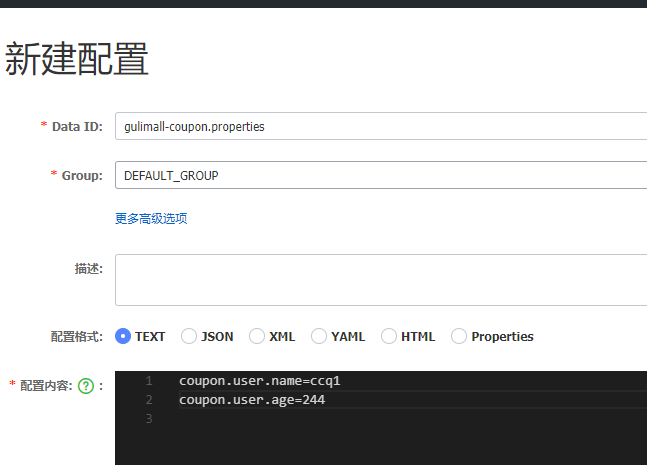

- 重启服务
- 可以获取配置中心新建的配置文件内容


- 如果我们想要修改配置中心的配置文件内容, 并且服务也可以动态获取而不需要重启
- 需要在调用的Controller类上面添加 @RefreshScop注解


### Nacos配置中心总结

1. 引入Nacos Config starter 依赖
2. 添加bootstrap.properties配置文件
   1. 配置当前服务的名称
   2. 配置nacos配置中心的地址
3. 在配置中心添加一个数据集(Data Id) gulimall-coupon.properties
   1. 默认命名方式为 <应用名.properties>
   2. 在配置文件中可以随时修改信息发布
4. 在需要获取到配置中心配置文件内容(@Value("${properties的key}$"))的类上添加 @RefreshScope注解, 让该微服务可以动态的从配置中心配置文件获取内容
5. 如果配置中心和当前应用的配置文件都配置了相同的项,优先使用配置中心的项


### Nacos配置中心细节

#### 命名空间

- 配置隔离

- 利用命名空间来做环境隔离
- 默认: public(保留空间)
- 默认新增的所有配置都在public空间


1. 开发(dev) 测试(test) 发布(prop) 创建三个命名空间

   1. 

   2. 在prop命名空间创建一个相同的配置文件, 也包含相同的名称但是对应的内容是上线后所需要的信息

   3. 这时默认获取到的是public下的配置文件

   4. 我们需要在bootstrap.properties中添加指定的命名空间(通过命名空间的id),这样就会获取对应命名空间的配置文件的信息

   5. 

   6. ```properties
      #想要使用哪个命名空间的配置,就在这里配置命名等于对应的uuid
      spring.cloud.nacos.config.namespace=c4f85683-4dae-4199-abb2-673c786365a9
      ```

   7. 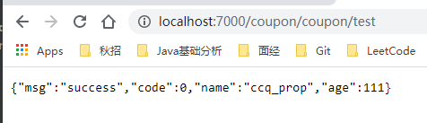

2. 每一个微服务之间互相隔离配置,每一个微服务都创建自己的命名空间, 只加载自己的命名空间

   1. 创建微服务对应的命名空间
   2. 配置文件中指定自己服务的命名空间


#### 配置集

- 所有配置的集合

#### 配置集ID

- 类似于配置文件名
- **Data ID**

#### 配置分组

- 默认所有的配置集都属于DEFAULT_GROUP

- 1111 618 1212

- 创建配置的时候输入Group

  - 

- 可以在应用的配置文件bootstrap.properties中指定配置组

  - ```properties
    spring.cloud.nacos.config.group=1111
    ```

  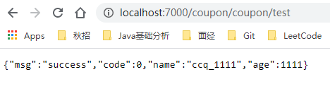

> 我们项目的配置情况

- 每个微服务创建自己的命名空间
- 使用配置分组区分环境, dev test, prod


### 同时加载多个配置集

- 在配置中心对应服务的命名空间下创建多个yaml文件拆分原本原来有应用的application.yml文件

- 拆分成datasource mybatis other三个部分, 每个部分更加明确自己的配置目的便于管理

  - 

- 在bootstrap.properties中配置从配置中心指定命名空间读取这些分解的yaml配置文件

  - ```properties
    spring.application.name=gulimall-coupon
    
    spring.cloud.nacos.config.server-addr=127.0.0.1:8848
    ##想要使用哪个命名空间的配置,就在这里配置命名等于对应的id
    spring.cloud.nacos.config.namespace=37b1e456-bc5d-4e95-9247-30d4b219a768
    ##指定分组的配置文件
    #spring.cloud.nacos.config.group=dev
    
    #ext-config返回的是一个list所以可以设置多个
    #这只是加载了一个配置集, 分别设置了data-id group 以及是否动态更新
    spring.cloud.nacos.config.ext-config[0].data-id=datasource.yaml
    spring.cloud.nacos.config.ext-config[0].group=dev
    spring.cloud.nacos.config.ext-config[0].refresh=true
    
    spring.cloud.nacos.config.ext-config[1].data-id=mybatis.yaml
    spring.cloud.nacos.config.ext-config[1].group=dev
    spring.cloud.nacos.config.ext-config[1].refresh=true
    
    spring.cloud.nacos.config.ext-config[2].data-id=other.yaml
    spring.cloud.nacos.config.ext-config[2].group=dev
    spring.cloud.nacos.config.ext-config[2].refresh=true
    ```

- 这样在加载的时候, 就会获取到这些指定的配置文件


- 测试
  - 访问 http://localhost:7000/coupon/coupon/list
  - 

#### 同时加载多个配置集总结

1. 微服务任何配置信息, 任何配置文件都可以放在配置中心中
2. 只需要在 bootstrap.properties说明加载配置中心中哪些配置文件即可
3. @Value  @ConfigurationProperties
4. 以前springboot从配置文件中获取值, 都能使用
5. 配置中心有的优先使用配置中心的


## API网关

https://spring.io/projects/spring-cloud-gateway


### 基本概念

- **Route**: The basic building block of the gateway. It is defined by an ID, a destination URI, a collection of predicates, and a collection of filters. A route is matched if the aggregate predicate is true.
- **Predicate**: This is a [Java 8 Function Predicate](https://docs.oracle.com/javase/8/docs/api/java/util/function/Predicate.html). The input type is a [Spring Framework `ServerWebExchange`](https://docs.spring.io/spring/docs/5.0.x/javadoc-api/org/springframework/web/server/ServerWebExchange.html). This lets you match on anything from the HTTP request, such as headers or parameters.
- **Filter**: These are instances of [`GatewayFilter`](https://github.com/spring-cloud/spring-cloud-gateway/tree/main/spring-cloud-gateway-server/src/main/java/org/springframework/cloud/gateway/filter/GatewayFilter.java) that have been constructed with a specific factory. Here, you can modify requests and responses before or after sending the downstream request.


- 客户端请求到达网关
- 网关通过请求的参数信息(请求头...)判断是否能通过某个Route的映射规则到达某个服务
- 如果可以, 就通过Route的规则去到某个服务
- 在请求某个服务的过程中还会经过一系列的过滤器

### 创建一个新的模块gulimall-gateway

1. 引入 common模块的依赖 (spring-initiar)

2. 开启服务注册发现

   1. 主启动类加上 @EnableDiscoveryClient 将自己注册到注册中心 这样可以找到其他的服务

3. 配置Nacos的地址 (application.properties)

   1. ```properties
      spring.cloud.nacos.discovery.server-addr=127.0.0.1:8848
      spring.application.name=gulimall-gateway
      server.port=88
      ```

4. 配置中心的配置文件 bootstrap.properties

   1. ```properties
      spring.cloud.name=gulimall-coupon
      spring.cloud.nacos.config.server-addr=127.0.0.1:8848
      spring.cloud.nacos.config.namespace=aa6b1b27-e3c7-47f4-bd46-8af2c09d1b4b
      ```

5. 在nacos中为gateway模块创建一个名称空间

   1. 创建一个简单的配置文件

6. 这里运行报错

   1. 因为我们引入了common模块的依赖, 而common模块中包含mybatis依赖, 所以会有数据库相关的默认配置

      1. 

   2. 我们需要排除这些与数据库相关的依赖

   3. exclude DataSourceAutoConfiguration

   4. ```java
      @EnableDiscoveryClient //开启服务注册发现
      @SpringBootApplication(exclude={DataSourceAutoConfiguration.class})
      public class GulimallGatewayApplication {
          public static void main(String[] args) {
              SpringApplication.run(GulimallGatewayApplication.class, args);
          }
      
      }
      ```

7. 编写网关服务的配置

```yml
spring:
  cloud:
    gateway:
      routes:
        - id: test_route
          uri: http://www.baidu.com  #predicate满足的情况下跳转的地址
          predicates:
            - Query=url,baidu         #如果请求参数包含 url 并且url参数的值为 baidu就去http://www.baidu.com
        - id: qq_route
          uri: http://www.qq.com
          predicates:
            - Query=url,qq            #如果请求参数包含 url 并且url参数的值为 qq 就去http://www.qq.com
```

- 测试访问带参数 url=qq访问成功
  - http://localhost:88/?url=qq

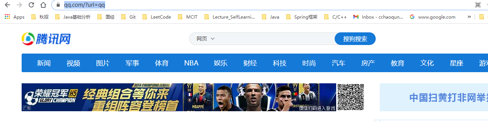

- 测试访问带参数 url=baidu访问成功
  - http://localhost:88/?url=baidu


# 前端基础知识

## 前端技术栈类比


## ES6

- 浏览器脚本的规范
- js是具体实现

```shell
# shift + ! 生成初始 html框架
shift+!
alt+shift+f 格式
```

### let

- let不会作用到{}外，var会越域跳到{}外
- var可以多次声明同一变量，let会报错
- var定义之前可以使用，let定义之前不可使用。（变量提升问题）
- var在{}之外也起作用
- let在{}不起作用
- var多次声明同一变量不会报错，let多次声明会报错，只能声明一次。
- var 会变量提升（打印和定义可以顺序反）。let 不存在变量提升（顺序不能反）
- let的·声明之后不允许改变

```html
<!DOCTYPE html>
<html lang="en">
<head>
    <meta charset="UTF-8">
    <meta http-equiv="X-UA-Compatible" content="IE=edge">
    <meta name="viewport" content="width=device-width, initial-scale=1.0">
    <title>Document</title>
</head>
<body>
    <script>
        // var 声明的变量往往会越域
       // let 声明的变量有严格局部作用域
       {
             var a = 1;
             let b = 2;
         }
         console.log(a);  // 1
         console.log(b);  // ReferenceError: b is not defined

         // var 可以声明多次
         // let 只能声明一次
         var m = 1
         var m = 2
         let n = 3
//         let n = 4
         console.log(m)  // 2
         console.log(n)  // Identifier 'n' has already been declared

        // var 会变量提升
        // let 不存在变量提升
         console.log(x);  // undefined
         var x = 10;
         console.log(y);   //ReferenceError: y is not defined
         let y = 20;

        // let
        // 1. const声明之后不允许改变
           // 2. 一但声明必须初始化，否则会报错
        const a = 1;
        a = 3; //Uncaught TypeError: Assignment to constant variable.

    </script>
</body>
</html>
```


### 结构表达式

- 支持`let arr = [1,2,3]; let [a,b,c] = arr;`这种语法
- 支持对象解析：`const { name: abc, age, language } = person;` 冒号代表改名，`旧:新`
- 字符串函数
- 支持一个字符串为多行``
- 占位符功能 ${}

```html
<!DOCTYPE html>
<html lang="en">
<head>
    <meta charset="UTF-8">
    <meta http-equiv="X-UA-Compatible" content="IE=edge">
    <meta name="viewport" content="width=device-width, initial-scale=1.0">
    <title>Document</title>
</head>
<body>
    <script>
        //数组解构
        let arr = [1,2,3];
        // // let a = arr[0];
        // // let b = arr[1];
        // // let c = arr[2];

        let [a,b,c] = arr;
        console.log(a,b,c)

        const person = {
            name: "jack",
            age: 21,
            language: ['java', 'js', 'css']
        }
        //         const name = person.name;
        //         const age = person.age;
        //         const language = person.language;

        //对象解构 // 把name属性变为abc，声明了abc、age、language三个变量
        const { name: abc, age, language } = person;
        console.log(abc, age, language)

        //4、字符串扩展
        let str = "hello.vue";
        console.log(str.startsWith("hello"));//true
        console.log(str.endsWith(".vue"));//true
        console.log(str.includes("e"));//true
        console.log(str.includes("hello"));//true

        //字符串模板 ``可以定义多行字符串
        let ss = `<div>
                    <span>hello world<span>
                </div>`;
        console.log(ss);
        
        function fun() {
            return "这是一个函数"
        }

        // 2、字符串插入变量和表达式。变量名写在 ${} 中，${} 中可以放入 JavaScript 表达式。
        let info = `我是${abc}，今年${age + 10}了, 我想说： ${fun()}`;
        console.log(info);
    </script>
</body>
</html>
```


### 函数优化.html

- 支持函数形参默认值 function add2(a, b = 1) {
- 支持不定参数 function fun(...values) {
- 支持箭头函数 var print = obj => console.log(obj);
- 箭头函数+结构 var hello2 = ({name}) => console.log("hello," +name);，本来应该是person.name

```html
<!DOCTYPE html>
<html lang="en">

<head>
    <meta charset="UTF-8">
    <meta name="viewport" content="width=device-width, initial-scale=1.0">
    <meta http-equiv="X-UA-Compatible" content="ie=edge">
    <title>Document</title>
</head>
<body>

    <script>
        //在ES6以前，我们无法给一个函数参数设置默认值，只能采用变通写法：
        function add(a, b) {
            // 判断b是否为空，为空就给默认值1
            b = b || 1;
            return a + b;
        }
        // 传一个参数
        console.log(add(10));


        //现在可以这么写：直接给参数写上默认值，没传就会自动使用默认值
        function add2(a, b = 1) {
            return a + b;
        }
        console.log(add2(20));


        //2）、不定参数
        function fun(...values) {
            console.log(values.length)
        }
        fun(1, 2)      //2
        fun(1, 2, 3, 4)  //4

        //3）、箭头函数。lambda
        //以前声明一个方法
        // var print = function (obj) {
        //     console.log(obj);
        // }
        var print = obj => console.log(obj);
        print("hello");

        var sum = function (a, b) {
            c = a + b;
            return a + c;
        }

        var sum2 = (a, b) => a + b;
        console.log(sum2(11, 12));

        var sum3 = (a, b) => {
            c = a + b;
            return a + c;
        }
        console.log(sum3(10, 20))


        const person = {
            name: "jack",
            age: 21,
            language: ['java', 'js', 'css']
        }

        function hello(person) {
            console.log("hello," + person.name)
        }

        //箭头函数+解构
        var hello2 = ({name}) => console.log("hello," +name);
        hello2(person);

    </script>
</body>
</html>

```


### 对象优化

对象简写很常见

- 可以获取map的键值对等Object.keys()、values、entries
- Object.assgn(target,source1,source2) 合并
- 如果属性名和属性值的变量名相同，可以省略const person2 = { age, name } 代表age属性的值是变量age的值
- …代表取出该对象所有属性拷贝到当前对象。let someone = { …p1 }


```html
<!DOCTYPE html>
<html lang="en">
<head>
    <meta charset="UTF-8">
    <meta name="viewport" content="width=device-width, initial-scale=1.0">
    <meta http-equiv="X-UA-Compatible" content="ie=edge">
    <title>Document</title>
</head>
<body>
    <script>
        const person = {
            name: "jack",
            age: 21,
            language: ['java', 'js', 'css']
        }

        console.log(Object.keys(person));//["name", "age", "language"]
        console.log(Object.values(person));//["jack", 21, Array(3)]
        console.log(Object.entries(person));//[Array(2), Array(2), Array(2)]

        const target  = { a: 1 };
        const source1 = { b: 2 };
        const source2 = { c: 3 };

        // 合并
        //{a:1,b:2,c:3}
        Object.assign(target, source1, source2);

        console.log(target);//["name", "age", "language"]

        //2）、声明对象简写
        const age = 23
        const name = "张三"
        const person1 = { age: age, name: name }
        // 等价于
        const person2 = { age, name }//声明对象简写
        console.log(person2);

        //3）、对象的函数属性简写
        let person3 = {
            name: "jack",
            // 以前：
            eat: function (food) {
                console.log(this.name + "在吃" + food);
            },
            //箭头函数this不能使用，要使用的话需要使用：对象.属性
            eat2: food => console.log(person3.name + "在吃" + food),
            eat3(food) {
                console.log(this.name + "在吃" + food);
            }
        }

        person3.eat("香蕉");
        person3.eat2("苹果")
        person3.eat3("橘子");

        //4）、对象拓展运算符

        // 1、拷贝对象（深拷贝）
        let p1 = { name: "Amy", age: 15 }
        let someone = { ...p1 }
        console.log(someone)  //{name: "Amy", age: 15}

        // 2、合并对象
        let age1 = { age: 15 }
        let name1 = { name: "Amy" }
        let p2 = {name:"zhangsan"}
        p2 = { ...age1, ...name1 } 
        console.log(p2)
    </script>
</body>

</html>

```


### map和reduce.html

- `map()`：接收一个函数，将原数组中的所有元素用这个函数处理后放入新数组返回。
- `reduce()` 为数组中的每一个元素依次执行回调函数，不包括数组中被删除或从未被赋值的元素，

```html
arr = arr.map(item=> item*2);

//[2, 40, -10, 6]
arr.reduce(callback,[initialValue])
/**
    1、previousValue （上一次调用回调返回的值，或者是提供的初始值（initialValue））
    2、currentValue （数组中当前被处理的元素）
    3、index （当前元素在数组中的索引）
    4、array （调用 reduce 的数组）*/

```

- map处理，arr = arr.map(item=> item*2);
- reduce。arr.reduce((原来的值,处理后的值即return的值)=>{

```html
<!DOCTYPE html>
<html lang="en">
<head>
    <meta charset="UTF-8">
    <meta name="viewport" content="width=device-width, initial-scale=1.0">
    <meta http-equiv="X-UA-Compatible" content="ie=edge">
    <title>Document</title>
</head>
<body>
    
    <script>
        //数组中新增了map和reduce方法。
         let arr = ['1', '20', '-5', '3'];
         
        //map()：接收一个函数，将原数组中的所有元素用这个函数处理后放入新数组返回。
        //  arr = arr.map((item)=>{
        //     return item*2
        //  });
         arr = arr.map(item=> item*2);

        

         console.log(arr);
        //reduce() 为数组中的每一个元素依次执行回调函数，不包括数组中被删除或从未被赋值的元素，
        //[2, 40, -10, 6]
        //arr.reduce(callback,[initialValue])
        /**
        1、previousValue （上一次调用回调返回的值，或者是提供的初始值（initialValue））
        2、currentValue （数组中当前被处理的元素）
        3、index （当前元素在数组中的索引）
        4、array （调用 reduce 的数组）*/
        let result = arr.reduce((a,b)=>{
            console.log("上一次处理后："+a);
            console.log("当前正在处理："+b);
            return a + b;
        },100);
        console.log(result)

    
    </script>
</body>
</html>

```


### promise

优化异步操作。封装ajax

以前嵌套ajax的时候很繁琐。

- 把Ajax封装到Promise中，赋值给let p
- 在Ajax中成功使用resolve(data)，失败使用reject(err)
- p.then().catch()

```json
corse_score_10.json 得分
{
    "id": 100,
    "score": 90
}
user.json 用户
{
    "id": 1,
    "name": "zhangsan",
    "password": "123456"
}
user_corse_1.json 课程
{
    "id": 10,
    "name": "chinese"
}
```


```html
<!DOCTYPE html>
<html lang="en">

<head>
    <meta charset="UTF-8">
    <meta http-equiv="X-UA-Compatible" content="IE=edge">
    <meta name="viewport" content="width=device-width, initial-scale=1.0">
    <title>Document</title>
    <script src="https://cdn.bootcss.com/jquery/3.4.1/jquery.min.js"></script>
</head>

<body>
    <script>
        //1. 查出当前用户信息
        //2. 按照当前用户的id查出他的课程
        //3. 按照当前课程id查出分数
        //=============传统方法==============
        // $.ajax({
        //     //查询地址
        //     url: "mock/user.json",
        //     //查询成功 获取查询到的数据data
        //     success(data) {
        //         //打印查询到的用户信息
        //         console.log("查询用户", data);
        //         //继续异步根据用户信息查询课程信息
        //         $.ajax({
        //             //``需要拼接字符串 通过用户id查询课程信息
        //             url: `mock/user_course_${data.id}.json`,
        //             //查询成功获得课程信息
        //             success(data) {
        //                 //打印课程信息
        //                 console.log("查到课程: ", data);
        //                 //继续查询课程分数
        //                 $.ajax({
        //                     //根据课程id查询分数
        //                     url: `mock/course_score_${data.id}.json`,
        //                     //查询成功
        //                     success(data) {
        //                         //打印分数
        //                         console.log("查到分数: ", data);
        //                     },
        //                     error(error) {
        //                         console.log("出现异常了: ", +error);
        //                     }
        //                 });
        //             },
        //             error(error) {
        //                 console.log("出现异常了: ", +error);
        //             }
        //         });
        //     },
        //     error(error) {
        //         console.log("出现异常了: ", +error);
        //     }
        // });


        //=============Promise==============
        // let p = new Promise((resolve, reject)=>{
        //     //1.异步操作
        //     $.ajax({
        //         //查询
        //         url: "mock/user.json",
        //         //成功了就解析数据并返回
        //         success: function (data){
        //             console.log("查询用户成功~",data);
        //             resolve(data);
        //         },
        //         //error
        //         error: function (err){
        //             reject(err);
        //         }
        //     })
        // });

        // p.then((obj)=>{//成功以后做什么
        //     return new Promise((resolve, reject)=>{
        //         $.ajax({
        //             url: `mock/user_course_${obj.id}.json`,
        //             success: function (data){
        //                 console.log("查询到用户课程成功:~", data);
        //                 resolve(data);
        //             },
        //             error: function (err){
        //                 reject(err);
        //             }
        //         })
        //     });
        // }).then((obj)=>{
        //     console.log("上一步的结果~ ", obj);
        //     $.ajax({
        //         url: `mock/course_score_${obj.id}.json`,
        //         success: function (data){
        //             console.log("查询到课程分数~: ",data);
        //         },
        //         error: function (err){
        //         }
        //     });
        // });

        //==============封装================
        //自定义方法整合
        function get(url, data) {
            return new Promise((resolve, reject) => {
                $.ajax({
                    url: url,
                    data: data,
                    success: function (data) {
                        resolve(data);
                    },
                    error: function (err){
                        reject(err);
                    }
                });
            });
        }

        get("mock/user.json")
            .then((data)=>{
                console.log("用户~~: ",data);
                return get(`mock/user_course_${data.id}.json`);
            })
            .then((data)=>{
                console.log("课程~~; ",data);
                return get(`mock/course_score_${data.id}.json`);
            })
            .then((data)=>{
                console.log("课程~~: ",data);
            })
            .catch((err)=>{
                console.log("出现异常", err);
            });
    </script>
</body>
</html>
```


### 模块化import/export

模块化就是把代码进行拆分，方便重复利用。类似于java中的导包，而JS换了个概念，是导模块。

模块功能主要有两个命令构成 export 和import

- export用于规定模块的对外接口
- import用于导入其他模块提供的功能


user.js

```json
var name = "jack"
var age = 21
function add(a,b){
    return a + b;
}
// 导出变量和函数
export {name,age,add}

```

hello.js

```json
// export const util = {
//     sum(a, b) {
//         return a + b;
//     }
// }

// 导出后可以重命名
export default {
    sum(a, b) {
        return a + b;
    }
}
// export {util}

//`export`不仅可以导出对象，一切JS变量都可以导出。比如：基本类型变量、函数、数组、对象。

```

main.js

```json
import abc from "./hello.js"
import {name,add} from "./user.js"

abc.sum(1,2);
console.log(name);
add(1,3);

```


# VUE

MVVM思想

- M：model 包括数据和一些基本操作
- V：view 视图，页面渲染结果

- VM：View-model，模型与视图间的双向操作（无需开发人员干涉）

视图和数据通过VM绑定起来，model里有变化会自动地通过Directives填写到视view中，视图表单中添加了内容也会自动地通过DOM Listeners保存到模型中。

教程：https://cn.vuejs.org/v2/guide/

```shell

view     ViewModel  Model
只要我们Model发生了改变，View上自然就会表现出来。
当用户修改了View，Model中的数据也会跟着改变。
把开发人员从琐的D0M操作中解放出来，那关注点放在如何操作Model上。
```

https://cn.vuejs.org/


## 安装：

- 下载js并用 <script> 标签引入：<script src="https://cdn.jsdelivr.net/npm/vue/dist/vue.js"></script>
- 或者在VScode控制台使用npm install vue导入。步骤分为：
  - 先npm init -y初始化项目，生成了一个package.json文件，说明他是一个npm管理的项目
    - 类似于maven的pom.xml
  - npm install vue，安装后在项目node_modules里有vue
    - 类似maven install拉取远程到本地

```shell
#初始化
npm init -y

#安装vue
npm install vue
```


## Vue-指令

使用：

- new Vue
- 在dom中{{name}}代表从模型中放到view中
- v-model实现双向绑定

```html
<script src="./node_modules/vue/dist/vue.js" ></script>
```

```html
<!DOCTYPE html>
<html lang="en">

<head>
    <meta charset="UTF-8">
    <meta name="viewport" content="width=device-width, initial-scale=1.0">
    <meta http-equiv="X-UA-Compatible" content="ie=edge">
    <title>Document</title>
</head>

<body>

    <div id="app">
        <input type="text" v-model="num">
        v-model实现双向绑定。此处代表输入框和vue里的data绑定
        
        <button v-on:click="num++">点赞</button>
        v-on:click绑定事件，实现自增。
        
        <button v-on:click="cancel">取消</button>
        回调自定义的方法。 此时字符串里代表的函数
        
        <h1> {{name}} ,非常帅，有{{num}}个人为他点赞{{hello()}}</h1>
        先从vue中拿到值填充到dom，input再改变num值，vue实例更新，然后此处也更新
    </div>

    <!-- 导入依赖 -->
    <script src="./node_modules/vue/dist/vue.js"></script>

    <script>
        //1、vue声明式渲染
        let vm = new Vue({ //生成vue对象
            el: "#app",//绑定元素 div id="app" // 可以指定恰标签，但是不可以指定body标签
            data: {  //封装数据
                name: "张三",  // 也可以使用{} //表单中可以取出
                num: 1
            },
            methods:{  //封装方法
                cancel(){
                    this.num -- ;
                },
                hello(){
                    return "1"
                }
            }
        });
        // 还可以在html控制台vm.name

        //2、双向绑定,模型变化，视图变化。反之亦然。
        //3、事件处理

        //v-xx：指令

        //1、创建vue实例，关联页面的模板，将自己的数据（data）渲染到关联的模板，响应式的
        //2、指令来简化对dom的一些操作。
        //3、声明方法来做更复杂的操作。methods里面可以封装方法。

    </script>
</body>

</html>

```


### v-text v-html v-ref

这两个可以使用data数据。而<div>123{{}}</div>这种写法叫插值表达式，可以计算，可以取值，可以调用函数
这里还介绍v-html v-text区别
注意取的大多数不是请求域了，而是vue对象里的data

插值闪烁：

使用{{}}方式在网速较慢时会出现问题。在数据未加载完成时，页面会显示出原始的{{}}，
加载完毕后才显示正确数据，我们称为插值闪烁。
我们将网速调慢一些，然后刷新页面，试试看刚才的案例

```html
<!DOCTYPE html>
<html lang="en">
<head>
    <meta charset="UTF-8">
    <meta name="viewport" content="width=device-width, initial-scale=1.0">
    <meta http-equiv="X-UA-Compatible" content="ie=edge">
    <title>Document</title>
</head>
<body>
   
    <div id="app">
        {{msg}}  {{1+1}}  {{hello()}} 
        <!-- 前面的内容如果网速慢的话会先显示括号，然后才替换成数据。 -->
        <!-- v-html 和v-text能解决这个问题 -->
        <br/>
        
        <!-- 用v-html取内容 -->
        <span v-html="msg"></span>
        
        <br/>
        <!-- 原样显示 -->
        <span v-text="msg"></span>  
    </div>
   
    <script src="../node_modules/vue/dist/vue.js"></script>

    <script>
        new Vue({
            el:"#app",
            data:{
                msg:"<h1>Hello</h1>",
                link:"http://www.baidu.com"
            },
            methods:{
                hello(){
                    return "World"
                }
            }
        })
    </script>
    
</body>
</html>

```


### v-bind 单向绑定

- 问题：花括号只能写在标签体内（<div 标签内> 标签体 </div>），不能用在标签内。


- 插值表达式只能用在标签体里，如果我们这么用<a href="{{}}">是不起作用的，所以需要 <a v-bind:href="link">跳转</a>这种用法
- 解决：用v-bind:，简写为:。表示把model绑定到view。可以设置src、title、class等

在浏览器里vm.link="www.baidu.com"，此处vue数据改了，dom里跳转链接也改了class里有哪些内容可以通过vue数据的bool值添加删除，而在style中代表的是k:v值。也可以把v-bind:简写成:{{}}必须有返回值

```html
<!DOCTYPE html>
<html lang="en">
<head>
    <meta charset="UTF-8">
    <meta name="viewport" content="width=device-width, initial-scale=1.0">
    <meta http-equiv="X-UA-Compatible" content="ie=edge">
</head>
<body>

    <!-- 给html标签的属性绑定 -->
    <div id="app"> 

        <a v-bind:href="link">跳转</a>

        <!-- class,style  {class名：vue值}-->
        <span v-bind:class="{active:isActive,'text-danger':hasError}"
          :style="{color: color1,fontSize: size}">你好</span>

    </div>

    <script src="../node_modules/vue/dist/vue.js"></script>

    <script>
        let vm = new Vue({
            el:"#app",
            data:{
                link: "http://www.baidu.com",
                isActive:true,
                hasError:true,
                color1:'red',
                size:'36px'
            }
        })
    </script>

</body>
</html>

```


- 

#### 样式绑定v-bind:class

class 与 style 是 HTML 元素的属性，用于设置元素的样式，我们可以用 v-bind 来设置样式属性。

Vue.js v-bind 在处理 class 和 style 时， 专门增强了它。表达式的结果类型除了字符串之外，还可以是对象或数组。

```html
实例中将 isActive 设置为 true 显示了一个绿色的 div 块，如果设置为 false 则不显示：
<div v-bind:class="{ 'active': isActive }"></div>


text-danger 类背景颜色覆盖了 active 类的背景色：
<div class="static"
     v-bind:class="{ 'active' : isActive, 'text-danger' : hasError }">
</div>

```

下面使用一个属性代表了若干class

```html
<div id="app">
    <div v-bind:class="classObject"></div>
</div>

new Vue({
    el: '#app',
    data: {
        isActive: true,
        error: {
            value: true,
            type: 'fatal'
        }
    },
    computed: {
        classObject: function () {
            return {
                base: true,
                active: this.isActive && !this.error.value,
                'text-danger': this.error.value && this.error.type === 'fatal',
            }
        }
    }
})

```


### **双向绑定v-model**

v-bind只能从model到view。v-model能从view到model

```html
<!DOCTYPE html>
<html lang="en">
<head>
    <meta charset="UTF-8">
    <meta name="viewport" content="width=device-width, initial-scale=1.0">
    <meta http-equiv="X-UA-Compatible" content="ie=edge">
    <title>Document</title>
</head>
<body>

    <!-- 表单项，自定义组件 -->
    <div id="app">

        <!-- 精通的语言：如果是多选框，那么会把每个value值赋值给vue数据 -->
            <input type="checkbox" v-model="language" value="Java"> java<br/>
            <input type="checkbox" v-model="language" value="PHP"> PHP<br/>
            <input type="checkbox" v-model="language" value="Python"> Python<br/>
        选中了 {{language.join(",")}}
    </div>
    
    <script src="../node_modules/vue/dist/vue.js"></script>

    <script>
        let vm = new Vue({
            el:"#app",
            data:{
                language: []
            }
        })
    </script>

</body>
</html>

```

### v-on

- 事件监听可以使用 v-on 指令


- v-on:事件类型="方法" ，可以简写成@事件类型="方法"

>事件冒泡：大小div都有单机事件，点了内部div相当于外部div也点击到了。如果不想点击内部div冒泡到外部div，可以使用.prevent阻止事件冒泡用法是v-on:事件类型.事件修饰符="方法"还可以绑定按键修饰符
>
>v-on:keyup.up=“num+=2” @keyup.down=“num-=2” @click.ctrl=“num=10”

- 按键修饰符

```html
<!DOCTYPE html>
<html lang="en">

<head>
    <meta charset="UTF-8">
    <meta name="viewport" content="width=device-width, initial-scale=1.0">
    <meta http-equiv="X-UA-Compatible" content="ie=edge">
    <title>Document</title>
</head>

<body>
    <div id="app">
                
        <!--事件中直接写js片段-->
        <button v-on:click="num++">点赞</button>
        <!--事件指定一个回调函数，必须是Vue实例中定义的函数-->
        <button @click="cancel">取消</button>
        <!--  -->
        <h1>有{{num}}个赞</h1>


        <!-- 事件修饰符 -->
        <!-- 
            once
            stop 阻止冒泡
            prevent 阻止默认事件 如跳转

         -->
        <div style="border: 1px solid red;padding: 20px;" v-on:click.once="hello">
            大div
            <div style="border: 1px solid blue;padding: 20px;" @click.stop="hello">
                小div <br />
                <a href="http://www.baidu.com" @click.prevent.stop="hello">去百度</a>
            </div>
        </div>


        <!-- 按键修饰符： -->
        <!-- 双向绑定 num属性
            up: num+=3
            down: num-=2
            click+ctrl: num=10
        
        -->
        <input type="text" v-model="num" v-on:keyup.up="num+=2" @keyup.down="num-=2" @click.ctrl="num=10"><br />

        提示：

    </div>
    <script src="../node_modules/vue/dist/vue.js"></script>

    <script>
        new Vue({
            el:"#app",
            data:{
                num: 1
            },
            methods:{
                cancel(){
                    this.num--;
                },
                hello(){
                    alert("点击了")
                }
            }
        })
    </script>
</body>

</html>

```

Vue.js 为 v-on 提供了事件修饰符来处理 DOM 事件细节，如：event.preventDefault() 或 event.stopPropagation()。

Vue.js 通过由点 . 表示的指令后缀来调用修饰符。

- .stop - 阻止冒泡
- .prevent - 阻止默认事件
- .capture - 阻止捕获
- .self - 只监听触发该元素的事件
- .once - 只触发一次
- .left - 左键事件
- .right - 右键事件
- .middle - 中间滚轮事件


### v-for遍历

可以遍历 数组[] 字典{} 。对于字典`<li v-for="(value, key, index) in object">`

```html
<!DOCTYPE html>
<html lang="en">

<head>
    <meta charset="UTF-8">
    <meta name="viewport" content="width=device-width, initial-scale=1.0">
    <meta http-equiv="X-UA-Compatible" content="ie=edge">
    <title>Document</title>
</head>

<body>

    <div id="app">
        <ul>
            <!-- 4、遍历的时候都加上:key来区分不同数据，提高vue渲染效率 -->
            <li v-for="(user,index) in users" :key="user.name" v-if="user.gender == '女'">
                <!-- 1、显示user信息：v-for="item in items" -->
               当前索引：{{index}} ==> {{user.name}}  ==>   
                  {{user.gender}} ==>{{user.age}} <br>
                <!-- 2、获取数组下标：v-for="(item,index) in items" -->
                <!-- 3、遍历对象：
                        v-for="value in object"
                        v-for="(value,key) in object"
                        v-for="(value,key,index) in object" 
                -->
                对象信息：
                <span v-for="(v,k,i) in user">{{k}}=={{v}}=={{i}}；</span>
                <!-- 4、遍历的时候都加上:key来区分不同数据，提高vue渲染效率 -->
            </li>

            
        </ul>

        <ul>
            <li v-for="(num,index) in nums" :key="index"></li>
        </ul>
    </div>
    <script src="../node_modules/vue/dist/vue.js"></script>
    <script>         
        let app = new Vue({
            el: "#app",
            data: {
                users: [
                { name: '柳岩', gender: '女', age: 21 },
                { name: '张三', gender: '男', age: 18 },
                { name: '范冰冰', gender: '女', age: 24 },
                { name: '刘亦菲', gender: '女', age: 18 },
                { name: '古力娜扎', gender: '女', age: 25 }
                ],
                nums: [1,2,3,4,4]
            },
        })
    </script>
</body>

</html>

```


### v-if和v-show

在vue实例的data指定一个bool变量，然后v-show赋值即可。

show里的字符串也可以比较

if是根据表达式的真假，切换元素的显示和隐藏（操作dom元素）

区别：show的标签F12一直都在，if的标签会移除，

if操作dom树对性能消耗大

v-if和v-show.html

```html
<!DOCTYPE html>
<html lang="en">

<head>
    <meta charset="UTF-8">
    <meta name="viewport" content="width=device-width, initial-scale=1.0">
    <meta http-equiv="X-UA-Compatible" content="ie=edge">
    <title>Document</title>
</head>

<body>
    <!-- 
        v-if，顾名思义，条件判断。当得到结果为true时，所在的元素才会被渲染。
        v-show，当得到结果为true时，所在的元素才会被显示。 
    -->
    <div id="app">
        <button v-on:click="show = !show">点我呀</button>
        <!-- 1、使用v-if显示 -->
        <h1 v-if="show">if=看到我....</h1>
        <!-- 2、使用v-show显示 -->
        <h1 v-show="show">show=看到我</h1>
    </div>

    <script src="../node_modules/vue/dist/vue.js"></script>
        
    <script>
        let app = new Vue({
            el: "#app",
            data: {
                show: true
            }
        })
    </script>

</body>

</html>

```


### v-else和v-else-if


```html
<!DOCTYPE html>
<html lang="en">

<head>
    <meta charset="UTF-8">
    <meta name="viewport" content="width=device-width, initial-scale=1.0">
    <meta http-equiv="X-UA-Compatible" content="ie=edge">
    <title>Document</title>
</head>

<body>
    <div id="app">
        <button v-on:click="random=Math.random()">点我呀</button>
        <span>{{random}}</span>

        <h1 v-if="random>=0.75">
            看到我啦? &gt;= 0.75
        </h1>
        <h1 v-else-if="random>=0.5">
            看到我啦? &gt;= 0.5
        </h1>
        <h1 v-else-if="random>=0.2">
            看到我啦? &gt;= 0.2
        </h1>
        <h1 v-else>
            看到我啦? &lt; 0.2
        </h1>

    </div>


    <script src="../node_modules/vue/dist/vue.js"></script>
        
    <script>         
        let app = new Vue({
            el: "#app",
            data: { random: 1 }
        })     
    </script>
</body>

</html>

```


### 缩写@

Vue.js 为两个最为常用的指令提供了特别的缩写：

- v-bind 缩写


```html
<!-- 完整语法 -->
<a v-bind:href="url"></a>
<!-- 缩写 -->
<a :href="url"></a>

```

- v-on缩写

```html
<!-- 完整语法 -->
<a v-on:click="doSomething"></a>
<!-- 缩写 -->
<a @click="doSomething"></a>

```


## 计算属性和侦听器

### 计算属性computed

什么是计算属性：**属性**不是具体值，而是通过一个函数计算出来的，随时变化


```html
<!DOCTYPE html>
<html lang="en">

<head>
    <meta charset="UTF-8">
    <meta name="viewport" content="width=device-width, initial-scale=1.0">
    <meta http-equiv="X-UA-Compatible" content="ie=edge">
    <title>Document</title>
</head>

<body>
    <!-- 过滤器常用来处理文本格式化的操作。过滤器可以用在两个地方：双花括号插值和 v-bind 表达式 -->
    <div id="app">
        <ul>
            <li v-for="user in userList">
                {{user.id}} ==> {{user.name}} ==> {{user.gender == 1?"男":"女"}} ==>
                {{user.gender | genderFilter}} ==> {{user.gender | gFilter}}
            </li>
        </ul>
    </div>
    <script src="../node_modules/vue/dist/vue.js"></script>

    <script>

        // 全局过滤器
        Vue.filter("gFilter", function (val) {
            if (val == 1) {
                return "男~~~";
            } else {
                return "女~~~";
            }
        })

        let vm = new Vue({
            el: "#app",
            data: {
                userList: [
                    { id: 1, name: 'jacky', gender: 1 },
                    { id: 2, name: 'peter', gender: 0 }
                ]
            },
            filters: { // 局部过滤器，只可以在当前vue实例中使用
                genderFilter(val) {
                    if (val == 1) {
                        return "男";
                    } else {
                        return "女";
                    }
                }
            }
        })
    </script>
</body>

</html>

```

### 过滤器filter

定义filter组件后，管道符后面跟具体过滤器`{{user.gender | gFilter}}`

```html
<!DOCTYPE html>
<html lang="en">

<head>
    <meta charset="UTF-8">
    <meta name="viewport" content="width=device-width, initial-scale=1.0">
    <meta http-equiv="X-UA-Compatible" content="ie=edge">
    <title>Document</title>
</head>

<body>
    <!-- 过滤器常用来处理文本格式化的操作。过滤器可以用在两个地方：双花括号插值和 v-bind 表达式 -->
    <div id="app">
        <ul>
            <li v-for="user in userList">
                {{user.id}} ==> {{user.name}} ==> {{user.gender == 1?"男":"女"}} ==>
                {{user.gender | genderFilter}} ==> {{user.gender | gFilter}}
            </li>
        </ul>
    </div>
    <script src="../node_modules/vue/dist/vue.js"></script>

    <script>

        // 全局过滤器
        Vue.filter("gFilter", function (val) {
            if (val == 1) {
                return "男~~~";
            } else {
                return "女~~~";
            }
        })

        let vm = new Vue({
            el: "#app",
            data: {
                userList: [
                    { id: 1, name: 'jacky', gender: 1 },
                    { id: 2, name: 'peter', gender: 0 }
                ]
            },
            filters: { // 局部过滤器，只可以在当前vue实例中使用
                genderFilter(val) {
                    if (val == 1) {
                        return "男";
                    } else {
                        return "女";
                    }
                }
            }
        })
    </script>
</body>

</html>

```


## 组件化

在大型应用开发的时候，页面可以划分成很多部分。往往不同的页面，也会有相同的部分。例如可能会有相同的头部导航。

但是如果每个页面都自开发，这无疑增加了我们开发的成本。所以我们会把页面的不同分拆分成立的组件，然后在不同页面就可以共享这些组件，避免重复开发。

在vue里，所有的vue实例都是组件

组件其实也是一个vue实例，因此它在定义时也会接收：data、methods、生命周期函数等
不同的是组件不会与页面的元素绑定（所以不写el），否则就无法复用了，因此没有el属性。
但是组件渲染需要html模板，所以增加了template属性，值就是HTML模板
data必须是一个函数，不再是一个对象。
全局组件定义完毕，任何vue实例都可以直接在HTML中通过组件名称来使用组件了
下面的html内容是在说：

<div id="app">这个块跟下面的new Vue对象绑定
vue对象里指定了components属性，是指：标签里有子标签，'button-counter': buttonCounter代表有个组件叫buttonCounter，可以填充标签<button-counter>


```html
<!DOCTYPE html>
<html lang="en">

<head>
    <meta charset="UTF-8">
    <meta name="viewport" content="width=device-width, initial-scale=1.0">
    <meta http-equiv="X-UA-Compatible" content="ie=edge">
</head>

<body>

    <div id="app">
        <button v-on:click="count++">我被点击了 {{count}} 次</button>

        每个对象都是独立统计的
        <counter></counter>
        <counter></counter>
        <counter></counter>
        <counter></counter>
        <counter></counter>

        <button-counter></button-counter>
    </div>
    <script src="../node_modules/vue/dist/vue.js"></script>


    <script>
        //1、全局声明注册一个组件 // counter标签，代表button
        // 把页面中<counter>标签替换为指定的template，而template中的数据用data填充
        Vue.component("counter", {
            template: `<button v-on:click="count++">我被点击了 {{count}} 次</button>`,
            data() {// 如果 Vue 没有这条规则，点击一个按钮就可能会像如下代码一样影响到其它所有实例：
                return {
                    count: 1 // 数据
                }
            }
        });

        //2、局部声明一个组件
        const buttonCounter = {
            template: `<button v-on:click="count++">我被点击了 {{count}} 次~~~</button>`,
            data() {
                return {
                    count: 1
                }
            }
        };

        new Vue({
            el: "#app",
            data: {
                count: 1
            },
            components: { // 要用的组件
                'button-counter': buttonCounter
            }
        })
    </script>
</body>

</html>

```


## 生命周期


```html
<!DOCTYPE html>
<html lang="en">

<head>
    <meta charset="UTF-8">
    <meta name="viewport" content="width=device-width, initial-scale=1.0">
    <meta http-equiv="X-UA-Compatible" content="ie=edge">
    <title>Document</title>
</head>

<body>
    <div id="app">
        <span id="num">{{num}}</span>
        <button @click="num++">赞！</button>
        <h2>{{name}}，有{{num}}个人点赞</h2>
    </div>

    <script src="../node_modules/vue/dist/vue.js"></script>
    
    <script>
        let app = new Vue({
            el: "#app",
            data: {
                name: "张三",
                num: 100
            },
            methods: {
                show() {
                    return this.name;
                },
                add() {
                    this.num++;
                }
            },
            beforeCreate() {
                console.log("=========beforeCreate=============");
                console.log("数据模型未加载：" + this.name, this.num);
                console.log("方法未加载：" + this.show());
                console.log("html模板未加载：" + document.getElementById("num"));
            },
            created: function () {
                console.log("=========created=============");
                console.log("数据模型已加载：" + this.name, this.num);
                console.log("方法已加载：" + this.show());
                console.log("html模板已加载：" + document.getElementById("num"));
                console.log("html模板未渲染：" + document.getElementById("num").innerText);
            },
            beforeMount() {
                console.log("=========beforeMount=============");
                console.log("html模板未渲染：" + document.getElementById("num").innerText);
            },
            mounted() {
                console.log("=========mounted=============");
                console.log("html模板已渲染：" + document.getElementById("num").innerText);
            },
            beforeUpdate() {
                console.log("=========beforeUpdate=============");
                console.log("数据模型已更新：" + this.num);
                console.log("html模板未更新：" + document.getElementById("num").innerText);
            },
            updated() {
                console.log("=========updated=============");
                console.log("数据模型已更新：" + this.num);
                console.log("html模板已更新：" + document.getElementById("num").innerText);
            }
        });
    </script>
</body>

</html>

```


## VUE模块化开发

```shell
npm install webpack -g
npm install -g @vue/cli-
npm install --global vue-cli #全局安装vue
vue init webpack vue-demo #初始化我们的项目
#中间的选项按照下图
#进入vue-demo目录
npm run dev
#访问localhost8080
http://localhost:8080/
```


### Hello

- 组件都放在 src/components/

- 创建Hello.vue

  - ```vue
    <template>
        <div>
            <h1>hello, {{name}}</h1>
        </div>
    </template>
    
    <script>
    
    export default {
        data() {
            return{
                name:"ccq"
            }
        }
    }
    </script>
    
    <style>
    
    </style>
    ```

- 在router下的index.js增加一个对应我们Hello.vue程序的路由

- 同时需要引入我们的组件

  - 访问的路由是/hello

  - 名字是hello

  - 组件名称是Hello(在上面引入)

  - ```js
    import Vue from 'vue'
    import Router from 'vue-router'
    import HelloWorld from '@/components/HelloWorld'
    import Hello from '@/components/Hello'
    Vue.use(Router)
    
    export default new Router({
      routes: [
        {
          path: '/',
          name: 'HelloWorld',
          component: HelloWorld
        },
        {
            
          path: '/hello',
          name: "hello",
          component: Hello
        }
      ]
    })
    
    ```

- 在APP.vue主视图下添加一个连接

  - ```vue
    <router-link to="/hello">去Hello</router-link>
    <router-link to="/">去首页</router-link>
    ```

  - 这样在首页可以点击连接跳转到我们的hello程序


- 测试访问
  - http://localhost:8081/#/hello


# Element UI

https://element.eleme.cn/#/zh-CN/component/installation

## 安装导入

```shell
#安装
npm i element-ui

#导入Element UI
import ElementUI from 'element-ui';
import 'element-ui/lib/theme-chalk/index.css';
Vue.use(ElementUI);

```


## 使用组件

```vue
<template>
  <div>
    <h1>hello, {{ name }}</h1>
    <!-- element ui 单选框组件 
        label为 radio单选框的值
    -->
    <el-radio v-model="radio" label="1">备选项1</el-radio>
    <el-radio v-model="radio" label="2">备选项2</el-radio>
  </div>
</template>

<script>
export default {
  data() {
    return {
      name: "ccq",
      radio: "2"
    };
  },
};
</script>

<style>
</style>
```

- 默认选择了 2, 因为data对象中radio: "2"


## 搭建后台

- 利用container布局容器模板搭建后台程序

https://element.eleme.cn/#/zh-CN/component/container

```vue
<el-container style="height: 500px; border: 1px solid #eee">
  <el-aside width="200px" style="background-color: rgb(238, 241, 246)">
    <el-menu :default-openeds="['1', '3']">
      <el-submenu index="1">
        <template slot="title"><i class="el-icon-message"></i>导航一</template>
        <el-menu-item-group>
          <template slot="title">分组一</template>
          <el-menu-item index="1-1">选项1</el-menu-item>
          <el-menu-item index="1-2">选项2</el-menu-item>
        </el-menu-item-group>
        <el-menu-item-group title="分组2">
          <el-menu-item index="1-3">选项3</el-menu-item>
        </el-menu-item-group>
        <el-submenu index="1-4">
          <template slot="title">选项4</template>
          <el-menu-item index="1-4-1">选项4-1</el-menu-item>
        </el-submenu>
      </el-submenu>
      <el-submenu index="2">
        <template slot="title"><i class="el-icon-menu"></i>导航二</template>
        <el-menu-item-group>
          <template slot="title">分组一</template>
          <el-menu-item index="2-1">选项1</el-menu-item>
          <el-menu-item index="2-2">选项2</el-menu-item>
        </el-menu-item-group>
        <el-menu-item-group title="分组2">
          <el-menu-item index="2-3">选项3</el-menu-item>
        </el-menu-item-group>
        <el-submenu index="2-4">
          <template slot="title">选项4</template>
          <el-menu-item index="2-4-1">选项4-1</el-menu-item>
        </el-submenu>
      </el-submenu>
      <el-submenu index="3">
        <template slot="title"><i class="el-icon-setting"></i>导航三</template>
        <el-menu-item-group>
          <template slot="title">分组一</template>
          <el-menu-item index="3-1">选项1</el-menu-item>
          <el-menu-item index="3-2">选项2</el-menu-item>
        </el-menu-item-group>
        <el-menu-item-group title="分组2">
          <el-menu-item index="3-3">选项3</el-menu-item>
        </el-menu-item-group>
        <el-submenu index="3-4">
          <template slot="title">选项4</template>
          <el-menu-item index="3-4-1">选项4-1</el-menu-item>
        </el-submenu>
      </el-submenu>
    </el-menu>
  </el-aside>
  
  <el-container>
    <el-header style="text-align: right; font-size: 12px">
      <el-dropdown>
        <i class="el-icon-setting" style="margin-right: 15px"></i>
        <el-dropdown-menu slot="dropdown">
          <el-dropdown-item>查看</el-dropdown-item>
          <el-dropdown-item>新增</el-dropdown-item>
          <el-dropdown-item>删除</el-dropdown-item>
        </el-dropdown-menu>
      </el-dropdown>
      <span>王小虎</span>
    </el-header>
    
    <el-main>
      <el-table :data="tableData">
        <el-table-column prop="date" label="日期" width="140">
        </el-table-column>
        <el-table-column prop="name" label="姓名" width="120">
        </el-table-column>
        <el-table-column prop="address" label="地址">
        </el-table-column>
      </el-table>
    </el-main>
  </el-container>
</el-container>


<style>
  .el-header {
    background-color: #B3C0D1;
    color: #333;
    line-height: 60px;
  }
  
  .el-aside {
    color: #333;
  }
</style>

<script>
  export default {
    data() {
      const item = {
        date: '2016-05-02',
        name: '王小虎',
        address: '上海市普陀区金沙江路 1518 弄'
      };
      return {
        tableData: Array(20).fill(item)
      }
    }
  };
</script>
```


1. 编写vue组件
2. 在router中引入需要设置路由的组件
3. 在router中设置访问该组件的路由
4. APP.vue中的侧边栏的el-menu中添加router="true", 这样在下面的每个菜单栏可以通过设置index='要访问的路由路径', 点击菜单栏就可以显示对应的组件


# 商品服务


## 三级分类

### P45 查询, 递归树形结构获取

#### Controller层 (CategoryController)

- 添加获取所有分类的属性结构的路由

```java
//注入Service层
@Autowired
private CategoryService categoryService;
/** 全路径为 /product/category/list/tree
     * 查出所有分类以及子分类, 以树形结构组装起来列表
     */
@RequestMapping("/list/tree")
//@RequiresPermissions("product:category:list")
public R list(){
    //调用service层的listWithTree()方法获取所有的分类的三级树形结构
    List<CategoryEntity> entities = categoryService.listWithTree();
    //将获取的树形结构entities放入返回的HashMap中 对应的key=data
    return R.ok().put("data", entities);
}
```

#### Service层 (CategoryService)

```java
//查询所有的树形结构
List<CategoryEntity> listWithTree();
```

#### ServiceImpl(CategoryServiceImpl)

- 实现service层的方法 listWithTree()

```java
@Override
    public List<CategoryEntity> listWithTree() {
        //1.查出所有分类
        /*
        这里的baseMapper来自于当前CategoryServiceImpl继承的ServiceImpl中的泛型<CategoryDao>, 
        所以不需要注入categoryDao, 直接使用在ServiceImpl中注入的baseMapper即可调用Dao(Mapper)层的selectList方法
         */
        List<CategoryEntity> entities = baseMapper.selectList(null);

        //2.组装成父子树形结构

        //2.1 找到所有的一级分类(父分类id=0)
        //filter过滤所有查询到的CategoryEntity中父分级为0的
        List<CategoryEntity> level1Menus = entities.stream().filter(categoryEntity ->
                categoryEntity.getParentCid() == 0
        ).map((menu)->{//对这些经过filter符合要求的查询子节点
            menu.setChildren(getChildrens(menu, entities));
            return menu;
        }).sorted((menu1, menu2)->{//排序, 根据两个菜单排序的结果从小到大
            return (menu1.getSort()==null?0:menu1.getSort())-(menu2.getSort()==null?0:menu2.getSort());
        }).collect((Collectors.toList()));//收集

        return level1Menus;
    }

    /**
     * 递归查找所有菜单的子菜单
     * @param root 当前菜单
     * @param all 所有的菜单
     * @return 寻找root的所有子级菜单
     */
    private List<CategoryEntity> getChildrens(CategoryEntity root, List<CategoryEntity> all){
        List<CategoryEntity> children = all.stream().filter(categoryEntity->{
            //在所有的菜单中找到父级菜单id根root菜单id相同的就是root的子菜单
            return categoryEntity.getParentCid() == root.getCatId();
        }).map(categoryEntity->{
            //对找到的每个子菜单继续递归找子菜单并设置
            categoryEntity.setChildren(getChildrens(categoryEntity, all));
            return categoryEntity;
        }).sorted((menu1, menu2)->{
            //对菜单进行排序(需要先判断是否为空, 为空则给默认值0)
            return (menu1.getSort()==null?0:menu1.getSort())-(menu2.getSort()==null?0:menu2.getSort());
        }).collect(Collectors.toList());


        return children;
    }
```


- 查询出来的结果按照1,2,3级形成了tree


### P46 配置网关路由和路径重写

- 先开启后台的数据库 (启动虚拟机)
  - vagrant up

#### 打开renren-fast-vue(VSC)

```shell
npm run dev
#访问(前端会自动打开)
http://localhost:8001/#/login
```


#### 打开对应的后台 renren-fast

- 打开主启动项

#### 新增一级菜单

localhost:8001 --> 系统管理-->菜单管理-->新增


- 新增菜单
  - 刷新，看到左侧多了商品系统，添加的这个菜单其实是添加到了`guli-admin.sys_menu`表里


- 数据库中增加了


- 在菜单系统目录下新增 分类维护菜单
  - `guli-admin.sys_menu`表又多了一行，父id是刚才的商品系统id

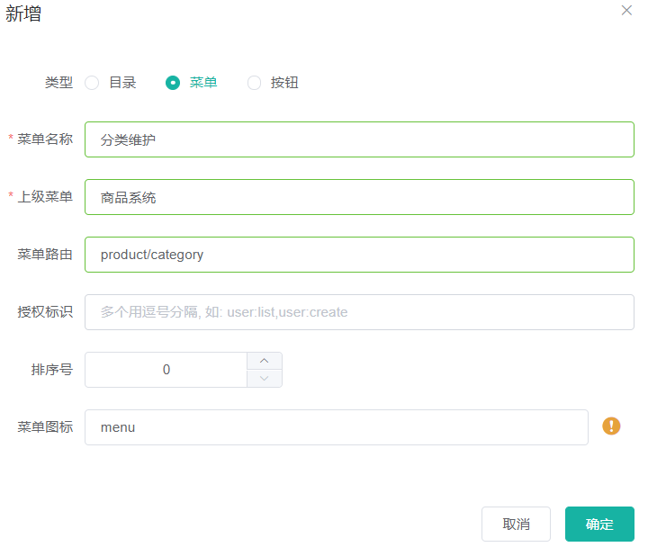

#### 菜单路由

- 在左侧点击【商品系统-分类维护】，希望在此展示3级分类。可以看到
  - url是http://localhost:8001/#/product-category
  - 填写的菜单路由是product/category
  - 对应的视图是src/view/modules/product/category.vue

- 再如sys-role具体的视图在`renren-fast-vue/views/modules/sys/role.vue`

- 所以要自定义我们的product/category视图的话，就是创建`mudules/product/category.vue`

- 输入vue快捷生成模板，然后去element-UI/组件/tree-树形控件 

  - https://element.eleme.cn/#/zh-CN/component/tree

  - 看如何使用多级目录

  - el-tree 标签中的data是要展示的树形结构

  - props属性设置

  - @node-click单击函数

  - ```vue
    <el-tree :data="data" :props="defaultProps" @node-click="handleNodeClick"></el-tree>
    
    <script>
      export default {
        data() {
          return {
            data: [{
              label: '一级 1',
              children: [{
                label: '二级 1-1',
                children: [{
                  label: '三级 1-1-1'
                }]
              }]
            }, {
              label: '一级 2',
              children: [{
                label: '二级 2-1',
                children: [{
                  label: '三级 2-1-1'
                }]
              }, {
                label: '二级 2-2',
                children: [{
                  label: '三级 2-2-1'
                }]
              }]
            }, {
              label: '一级 3',
              children: [{
                label: '二级 3-1',
                children: [{
                  label: '三级 3-1-1'
                }]
              }, {
                label: '二级 3-2',
                children: [{
                  label: '三级 3-2-1'
                }]
              }]
            }],
            defaultProps: {
              children: 'children',
              label: 'label'
            }
          };
        },
        methods: {
          handleNodeClick(data) {
            console.log(data);
          }
        }
      };
    </script>
    ```

- 我们这里希望使用我们自己从数据库中查到的三级商品分类的数据

  - ```vue
    <script>
    export default {
    //import引入的组件需要注入到对象中才能使用
    components: {},
    data() {
        return {
          data: [],
          defaultProps: {
            children: "children",
            label: "label",
          },
        };
    methods: {
        handleNodeClick(data) {
          console.log(data);
        },
        getMenus(){
            this.$http({
              url: this.$http.adornUrl('/product/category/list/tree'), //请求到后台数据库的地址
              method: 'get',
            }).then(({data}) => {
                console.log("成功获取到三级菜单数据...", data) //获取数据成功后执行的语句
            })
        }
      },
    </script>
    ```

#### 网关配置前端访问后台的请求路由

- 在登录管理后台的时候，我们会发现，他要请求`localhost:8080/renren-fast/product/category/list/tree`这个url

- 但是报错404找不到，此处就解决登录页验证码不显示的问题。

- 他要给8080发请求读取数据，但是数据是在10000端口的produc微服务上，如果找到了这个请求改端口那改起来很麻烦。

  - 方法1是改vue项目里的全局配置，
  - 方法2是搭建个网关，让网关路由到10000（即将vue项目里的请求都给网关，网关经过url处理后，去nacos里找到管理后台的微服务，就可以找到对应的端口了，这样我们就无需管理端口，统一交给网关管理端口接口）

- C+S+F全局搜索 localhost:8080/renren-fast, 查看哪里定义了访问后台的这个路径

  - 在`static/config/index.js`里

  - ```js
     window.SITE_CONFIG['baseUrl'] = 'http://localhost:88/api';
    // 意思是说本vue项目中要请求的资源url都发给88/api，那么我们就让网关端口为88，然后匹配到/api请求即可，
    // 网关可以通过过滤器处理url后指定给某个微服务
    // renren-fast服务已经注册到了nacos中
    ```

- 接着让重新登录http://localhost:8001/#/login，验证码是请求88的，所以不显示。而验证码是来源于fast后台的

  - 现在的验证码请求路径为，http://localhost:88/api/captcha.jpg?uuid=69c79f02-d15b-478a-8465-a07fd09001e6
  - 原始的验证码请求路径：http://localhost:8001/renren-fast/captcha.jpg?uuid=69c79f02-d15b-478a-8465-a07fd09001e6

- 88是gateway的端口

- 问题:他要去nacos中查找api服务，但是nacos里有的是fast服务，就通过网关过滤器把api改成fast服务

  - 所以让fast注册到服务注册中心，这里详细配置看 7.1.2.6

- 然后配置网关的路由规则

  - 需要通过负载均衡将前端对后台的请求都负载均衡到renren-fast服务(验证码)

  - 这里我们规定所有前端的请求都带上/api的前缀, 所以在断言中设置拦截的请求为/api开头

  - 对前端请求路由重写

    - 所有前端的请求路径为/api/**  我们需要替换成/renren-fast

  - ```yml
    - id: admin_route
              uri: lb://renren-fast     #lb代表负载均衡, 所有前端的后台对应请求都负载均衡到renren-fast服务(验证码)
              predicates:
                - Path=/api/**
              filters:
                - RewritePath=/api/?(?<segment>.*), /renren-fast/$\{segment} #路径替换 这样才能访问到后台的renren-fast获取验证码
    ## 前端项目, 访问路径带上/api前缀
    ## 实际访问的地址 http://localhost:88/api/captcha.jpg?uuid=8a15b0a0-baa7-46c2-8ea5-b7f91292ba56
    ## 我们希望访问的地址  http://localhost:8080/renren-fast/captcha.jpg
      #通过filter RewritePath将所有的/api/** 转变成/renren-fast/** 相当于将/api替换成了 /renren-fast
    ```

- 登录，还是报错：（出现了跨域的问题，就是说vue项目是8001端口，却要跳转到88端口，为了安全性，不可以）

- 

- 从8001访问88，引发CORS跨域请求，浏览器会拒绝跨域请求。具体来说当前页面是8001端口，但是要跳转88端口，这是不可以的(post请求json可以)

#### 网关路径重写的说明

- 修改过vue里的api后，此时验证码请求的是
  - http://localhost:88/api/captcha.jpg?uuid=72b9da67-0130-4d1d-8dda-6bfe4b5f7935
- 也就是说，他请求网关，路由到了fast，然后取nacos里找fast。

- 找到后拼接成了 http://renren-fast:8080/api/captcha.jpg

- 但是正确的是 http://localhost:8080/renren-fast/captcha.jpg

- 所以要利用网关带的路径重写，参考
  - https://docs.spring.io/spring-cloud-gateway/docs/current/reference/html/#the-rewritepath-gatewayfilter-factory
- 照猫画虎，在网关里写了如下，把api换成renren-fast（前面改过了）
  

#### 注册renren-fast服务到注册中心

- 因为我们的路由需要将所有的前端项目的请求转到renren-fast这样才能获取验证码数据
- 需要将renren-fast服务注册到Nacos注册中心, 这样网关才能找到这个微服务, 进而将请求转发过来


1. 引入Nacos注册中心依赖, 直接依赖gulimall-common即可, 那里引入了Nacos相关依赖

   - ```xml
     <dependency>
         <groupId>com.google.code.gson</groupId>
         <artifactId>gson</artifactId>
         <version>2.8.5</version>
     </dependency>
     ```

2. application.yml配置文件 配置微服务名字 以及Nacos server的地址

   - ```yml
     spring:
      application:
         name: renren-fast  #当前应用的名字
       cloud:
         nacos:
           discovery:
             server-addr: 127.0.0.1:8848  #配置nacos server地址
     ```

3. 主启动项上添加 @EnableDiscoveryClient, 将该微服务注册到Nacos服务中心

   - 


### P47 网关统一配置跨域

#### 跨域问题简介

- 跨域问题是浏览器对于 端口及以前的请求地址不同的请求不允许跨域请求, 即两个请求的 协议, 域名, 端口都必须完全相同才可以进行请求


- 跨域的流程是发送了两个请求, 第一个为OPTIONS预检请求, 去访问服务器, 询问是否允许跨域请求, 如果服务器响应允许, 则发送真实的带数据的请求


#### 两种解决方法

- 全部的请求通过Nginx代理, 这样所有的请求 协议 域名 端口都一致


- 配置所有的跨域请求, 
- 我们这里使用第二种方法


#### 网关中配置跨域请求

1. 网关模块新建config包,

2. 包内新建跨域请求的配置类

   1. ```java
      //配置类
      @Configuration
      public class GuliMallCorsConfiguration {
      
          //注册到Spring中
          @Bean
          public CorsWebFilter corsWebFilter(){
      
              UrlBasedCorsConfigurationSource source = new UrlBasedCorsConfigurationSource();
      
              CorsConfiguration corsConfiguration = new CorsConfiguration();
      
              //1.配置跨域
              //允许所有的请求头类型跨域
              corsConfiguration.addAllowedHeader("*");
              //允许任意请求方式跨域
              corsConfiguration.addAllowedMethod("*");
              //允许任意请求来源跨域
              corsConfiguration.addAllowedOrigin("*");
              //允许携带cookies跨域
              corsConfiguration.setAllowCredentials(true);
      
              source.registerCorsConfiguration("/**", corsConfiguration);
      
              return new CorsWebFilter(source);
          }
      }
      ```

3. 再次测试登录, 发现预检请求成功了, 多了我们刚才配置的请求头信息

   1. 

4. 但是真实请求失败, 因为请求头出现了重复的请求头信息, 这是因为renren-fast脚手架模块中也配置了相同的跨域请求, 我们需要将其注释掉

   1. 
   2. 
   3. 

5. 重新登录, 登录成功解决了所有的跨域问题

   1. 


### P48 查询-属性展示三级分类数据

#### 跨域设置成功但是无法获取数据

- 之前解决了登录验证码的问题，/api/请求重写成了/renren-fast，
- 但是vue项目中或者你自己写的数据库中有些是以/product为前缀的，它要请求product微服务，你要也让它请求renren-fast显然是不合适的。
- 解决办法是把请求在网关中以更小的范围先拦截一下，剩下的请求再交给renren-fast


- 这是因为网关上所做的路径映射不正确，映射后的路径为

  - http://localhost:8001/renren-fast/product/category/list/tree

- 但是只有通过http://localhost:10000/product/category/list/tree路径才能够正常访问，所以会报404异常。

- 解决方法就是在网关的配置文件application.yml中定义一个product路由规则，进行路径重写：

  - ```yml
      - id: product_route         #从网关-->renren-fast-->product
        uri: lb://gulimall-product #renren-fast的请求负载均衡到 product微服务
        predicates:
        - Path=/api/product/**    #/api/product 约定这个路径开头的都是商品微服务的请求
        filters:
        - RewritePath=/api/?(?<segment>.*), /$\{segment} # filter 路径重写去掉/api前缀 就能访问商品服务了
    ```

#### 配置product微服务到注册中心

我们如果需要将请求转到product微服务需要将product服务注册到Nacos注册中心以及配置product自己的配置环境

- application.yml

  - ```yml
    spring:
      datasource:
        username: root
        password: root
        url: jdbc:mysql://192.168.56.10:3306/gulimall_pms?useUnicode=true&characterEncoding=UTF-8&serverTimezone=Asia/Shanghai
        driver-class-name: com.mysql.cj.jdbc.Driver
      cloud:
        nacos:
          discovery:
            server-addr: 127.0.0.1:8848 #配置nacos注册中心的地址
      application:
        name: gulimall-product #配置服务的名称
    
    mybatis-plus:
      mapper-locations: classpath:/mapper/**/*.xml #扫描类路径下的 mapper文件夹下的所有文件夹中的xml文件
      global-config:
        db-config:
          id-type: auto
    
    server:
      port: 10000
    ```

- bootstrap.properties

  - ```properties
    #微服务的名称
    spring.application.name=gulimall-product
    #nacos配置中心的地址
    spring.cloud.nacos.config.server-addr=127.0.0.1:8848
    #配置中心创建product服务的命名空间, 获取对应的id复制过来
    spring.cloud.nacos.config.namespace=2bac7c44-5ec9-489a-9c12-8602a9872e09 
    
    ```

- 主启动类添加 @EnableDiscoveryClient //开启服务的注册与发现

Nacos配置中心配置product服务独立的配置环境


注册中心可以发现product服务


#### 调整网关路由的过滤等级顺序

- 访问 localhost:88/api/product/category/list/tree invalid token，非法令牌，后台管理系统中没有登录，所以没有带令牌
- 原因：先匹配的先路由，fast和product路由重叠，fast要求登录
- 修正：在路由规则的顺序上，将精确的路由规则放置到模糊的路由规则的前面，否则的话，精确的路由规则将不会被匹配到，类似于异常体系中try catch子句中异常的处理顺序。


- 再次访问, 可以访问并且获取数据


#### 数据解构

- 加上{}，把data的地方改成menus


- 此时有了3级结构，但是没有数据，在category.vue的模板中，数据是menus，而还有一个props。这是element-ui的规则，
- 


- 修改后name字段成功显示在页面


### P49 删除页面效果

- 删除的前提: 没有子节点 没有被其他菜单引用
  - 使用 render-content，渲染函数
  - 使用 scoped slot：https://element.eleme.cn/#/zh-CN/component/tree

>可以通过两种方法进行树节点内容的自定义：render-content和 scoped slot。
>
>使用render-content指定渲染函数，该函数返回需要的节点区内容即可。渲染函数的用法请参考 Vue 文档。
>使用 scoped slot 会传入两个参数node和data，分别表示当前节点的 Node 对象和当前节点的数据。
>注意：由于 jsfiddle 不支持 JSX 语法，所以render-content示例在 jsfiddle 中无法运行。但是在实际的项目中，只要正确地配置了相关依赖，就可以正常运行。

- scoped slot（插槽）：在el-tree标签里把内容写到span标签栏里即可

```vue
<template>
  <div>
    <el-tree
      :data="menus"
      :props="defaultProps"
             设置点击不展开结点子节点
      :expand-on-click-node="false"
             显示复选框
      show-checkbox
             结点的key唯一标识
      node.key="catId"
    >
      <span class="custom-tree-node" slot-scope="{ node, data }">
        <span>{{ node.label }}</span>
        <span>
          <el-button
            v-if="node.level <= 2"   非叶子结点
            type="text"
            size="mini"
            @click="() => append(data)" append按钮
          >
            Append
          </el-button>
          <el-button
            v-if="node.childNodes.length == 0" 叶子结点
            type="text"
            size="mini"
            @click="() => remove(node, data)" delete按钮
          >
            Delete
          </el-button>
        </span>
      </span>
    </el-tree>
  </div>
</template>
```


- 注意这列show-checkbox即可 不需要后面的 ="true"


- Node Data


### P50 删除逻辑

#### CategoryController添加批量删除的方法

- removeMenuByIds()

```java
/**
     * 删除
     * @RequestBody: 获取请求体, 必须发送POST请求
     * SprIngMVC自动将请求体的数据(json) 转为对应的对象
     */
    @RequestMapping("/delete")
    //@RequiresPermissions("product:category:delete")
    public R delete(@RequestBody Long[] catIds){
//		categoryService.removeByIds(Arrays.asList(catIds));

		categoryService.removeMenuByIds(Arrays.asList(catIds));

        return R.ok();
    }
```

#### Service层添加方法申明, Impl层实现批量删除

- Service层


- ServiceImpl层


#### Postman测试删除请求

- 下载POSTMAN模拟POST请求 测试CategoryController中的delete方法

- 全局设置逻辑删除的表示值


- 设置需要设置成逻辑删除的字段加上@TableLogic注解 并设置删除和未删除用什么值表示
- CategoryEntity的showStatus字段


- @TableLogic注解


- 日志信息, 显示删除的SQL语句


- Postman设置


- 删除后showStatus对应字段变成0


### P51 删除效果细化

#### 前端的拦截逻辑

- 发送的请求：delete


- 发送的数据：this.$http.adornData(ids, false)

  - util/httpRequest.js中，封装了一些拦截器

- http.adornParams是封装get请求的数据

  - ajax的get请求会被缓存，就不会请求服务器了。所以我们在url后面拼接个date（使之无法url不一致），让他每次都请求服务器

- http.adornData是封装`post`请求的数据

- ```js
  // 定义http对象，后面定义他的请求拦截器
  const http = axios.create({
    timeout: 1000 * 30,
    withCredentials: true,
    headers: {
      'Content-Type': 'application/json; charset=utf-8'
    }
  })
  
  /**
   * 请求地址处理
   * @param {*} actionName action方法名称
   */
  http.adornUrl = (actionName) => {
    // 非生产环境 && 开启代理, 接口前缀统一使用[/proxyApi/]前缀做代理拦截!
    return (process.env.NODE_ENV !== 'production' 
            && process.env.OPEN_PROXY ? '/proxyApi/' : window.SITE_CONFIG.baseUrl) + actionName
  }
  
  /**
   * 请求地址处理
   * @param {*} actionName action方法名称
   */
  http.adornUrl = (actionName) => {
    // 非生产环境 && 开启代理, 接口前缀统一使用[/proxyApi/]前缀做代理拦截!
    return (process.env.NODE_ENV !== 'production' 
            && process.env.OPEN_PROXY ? '/proxyApi/' : window.SITE_CONFIG.baseUrl) + actionName
  }
  
  /**
   * get请求参数处理
   * @param {*} params 参数对象
   * @param {*} openDefultParams 是否开启默认参数?
   */
  http.adornParams = (params = {}, openDefultParams = true) => {
    var defaults = {
      't': new Date().getTime()
    }
    return openDefultParams ? merge(defaults, params) : params
  }
  
  /**
   * post请求数据处理
   * @param {*} data 数据对象
   * @param {*} openDefultdata 是否开启默认数据?
   * @param {*} contentType 数据格式
   *  json: 'application/json; charset=utf-8'
   *  form: 'application/x-www-form-urlencoded; charset=utf-8'
   */
  http.adornData = (data = {}, openDefultdata = true, contentType = 'json') => {
    var defaults = {
      't': new Date().getTime()
    }
    data = openDefultdata ? merge(defaults, data) : data
    return contentType === 'json' ? JSON.stringify(data) : qs.stringify(data)
  }
  ```

- 抽取代码片段vue.code-snippets


```vue
{
    "http-get请求":{
        "prefix":"httpget",
        "body":[
            "this.\\$http({",
            "url:this,\\$http.adornUrl(''),",
            "method:'get',",
            "params:this.\\$http.adornParams({})",
            "}).then({data})=>{",
            "})"
        ],
        "description":"httpGET请求"
    },

    "http-post请求":{
        "prefix":"httppost",
        "body":[
            "this.\\$http({",
            "url:this,\\$http.adornUrl(''),",
            "method:'post',",
            "data: this.\\$http.adornData(data, false)",
            "}).then({data})=>{ })"
        ],
        "description":"httpPOST请求"
    }
}

```

- 删除时弹窗确认
- 删除成功弹窗
- 删除后重新展开父节点：重新ajax请求数据，指定展开的基准是:default-expanded-keys=“expandedKey”，返回数据后刷新this.expandedKey = [node.parent.data.catId];

#### 点击删除弹出确认框

#### 删除后显示删除后的菜单

#### 删除后保留删除结点的父节点展开

- category.vue中的remove方法

```vue
remove(node, data) {
      //获取结点的id数组
      var ids = [data.catId];
      this.$confirm(`是否删除[${data.name}]菜单?`, "提示", {
        confirmButtonText: "确定",
        cancelButtonText: "取消",
        type: "warning",
      })
        .then(() => {
          //选择删除执行以下操作
          this.$http({
            url: this.$http.adornUrl("/product/category/delete"),
            method: "post",
            data: this.$http.adornData(ids, false),
          }).then(({ data }) => {
            //删除成功, 显示提示消息
            this.$message({
              message: "菜单删除成功",
              type: "success",
            });
            //刷新出新的菜单
            this.getMenus();
            //设置需要默认展开的菜单
            this.expandedKey = [node.parent.data.catId]
          });
        })
        .catch(() => {
          //选择取消执行以下操作
        });

      console.log("remove", node, data);
    },
  },
```


- remove方法的解释


- 设置删除结点后默认展开删除结点的父节点, 即将父节点设置到expandedKey数组中刷新就可以看到父节点展开了


- data中对应的属性
  - 

- Messagebox


https://element.eleme.cn/#/zh-CN/component/message-box


### P52 新增 新增效果完成

- 实现点击新增按钮弹出对话框

- 对话框

https://element.eleme.cn/#/zh-CN/component/dialog

- 一个button的单击事件函数为@click=“dialogVisible = true”
- 一个会话的属性为:visible.sync=“dialogVisible”
- 导出的data中"dialogVisible = false"
- 点击确认或者取消后的逻辑都是@click=“dialogVisible = false” 关闭会话而已

```vue
<el-dialog title="提示" :visible.sync="dialogVisible" width="30%">
    <el-form :model="category">
        <el-form-item label="分类名称">
            <el-input v-model="category.name" autocomplete="off"></el-input>
        </el-form-item>
    </el-form>

    <span slot="footer" class="dialog-footer">
        <el-button @click="dialogVisible = false">取 消</el-button>
        <el-button type="primary" @click="addCategory">确 定</el-button>
    </span>
</el-dialog>
<script>
export default {
  //import引入的组件需要注入到对象中才能使用
  components: {},
  data() {
    return {
      category: { name: "", parentCid: 0, catLevel: 0, showStatus: 1, sort: 0 },
      dialogVisible: false,
      menus: [],
      expandedKey: [],
      defaultProps: {
        children: "children", //數據的子節點
        label: "name", //要顯示的字段
      },
    };
  },
    methods: {
        //添加三级分类的方法
        addCategory() {
            console.log("提交的三级分类的数据", this.category);
            this.$http({
                url: this.$http.adornUrl("/product/category/save"),
                method: "post",
                data: this.$http.adornData(this.category, false),
            }).then(({ data }) => {
                this.$message({
                    message: "菜单保存成功",
                    type: "success",
                });
                //保存成功后, 关闭对话框
                this.dialogVisible = false;
                //刷新出新的菜单
                this.getMenus();
                //设置需要默认展开的菜单
                this.expandedKey = [this.category.parentCid];
            });
        },
        append(data) {
            console.log("append", data);
            this.dialogVisible = true;
            this.category.parentCid = data.catId;
            this.category.catLevel = data.catLevel * 1 + 1;
        },
```


- dialog组件


- dialog相关数据


- 点击确定执行的 addCategory()
- 保存成功后
  1. 设置信息输入框消失
  2. 刷新数据
  3. 确定要显示的三级分类为当前添加的category对象的父节点


- 点击append弹出对话框


- 提交后控制台显示了添加的category对象的name为我们输入的信息


- 给了category对象一些默认属性以及计算后的属性


- 添加成功,显示消息提示框


- 数据库得到数据


### P53 修改 基本修改效果完成

>- 点击修改弹出对话框, 显示现有内容
>- 输入新内容后确定, 
>  - 同时弹出修改成功的提示
>  - 对应修改的对话框的父节点展开, 
>  - 并且从数据库获取修改后的数据显示出来, 
>- 对话框是复用的添加的对话框, 点击确定回调的是同一个函数 submitData
>  - 为了区分当前是修改还是添加, 添加一个dialogType, title属性
>  - dialogType决定继续调用哪个函数 通过if判断
>    - editCategory()
>    - addCategory()
>  - title决定对话框左上角显示的信息 "添加分类"/"修改分类"
>- 回显的时候要发送请求, 获取最新的数据库数据而不是上一次获得的, 防止中间数据库信息以及被别的用户修改了
>
>


- el-dialog 新增了 三个表单分别对应 name icon productUnit
- 同时修改点击确定执行的方法为submitData再在submitData中通过dialogType判断执行修改还是删除

```vue
<el-dialog
      :title="title"
      :visible.sync="dialogVisible"
      width="30%"
      :close-on-click-modal="false"
    >
      <el-form :model="category">
        <el-form-item label="分类名称">
          <el-input v-model="category.name" autocomplete="off"></el-input>
        </el-form-item>
      </el-form>
      <el-form :model="category">
        <el-form-item label="图标">
          <el-input v-model="category.icon" autocomplete="off"></el-input>
        </el-form-item>
      </el-form>
      <el-form :model="category">
        <el-form-item label="计量单位">
          <el-input
            v-model="category.productUnit"
            autocomplete="off"
          ></el-input>
        </el-form-item>
      </el-form>

      <span slot="footer" class="dialog-footer">
        <el-button @click="dialogVisible = false">取 消</el-button>
        <el-button type="primary" @click="submitData">确 定</el-button>
      </span>
    </el-dialog>
```

- submitData 和 editCategory

```vue
<script>
    submitData() {
        if (this.dialogType == "add") {
            this.addCategory();
        }
        if (this.dialogType == "edit") {
            this.editCategory();
        }
    },
    //点击edit, 输入修改的信息, 点击确定执行的方法
        editCategory() {
            //{}解构出我们需要向后台更新的信息属性
            var { catId, name, icon, productUnit } = this.category;
            //将解构出来的信息再封装成一个属性 key与后台对应的java bean属性一致, 值就是解构出来的值
            // var data = {catId: catId, name: name, icon: icon, productUnit: productUnit};
            //因为key value相同, 可以省略
            //直接将大括号内的内容放到后面的data中
            // var data = {catId, name, icon, productUnit};
            this.$http({
                url: this.$http.adornUrl("/product/category/update"),
                method: "post",
                data: this.$http.adornData({ catId, name, icon, productUnit }, false),
            }).then(({ data }) => {
                this.$message({
                    message: "菜单修改成功",
                    type: "success",
                });
                //保存成功后, 关闭对话框
                this.dialogVisible = false;
                //刷新出新的菜单
                this.getMenus();
                //设置需要默认展开的菜单
                //这里的category是我们从对后台的请求中获取的, 我们在回显信息中加了parentCid 所以这里直接显示父级菜单即可
                this.expandedKey = [this.category.parentCid];
            });
        },
```


- 点击edit 回显分类的信息


- 修改append方法获得的category其他信息, 将其置为默认值或空

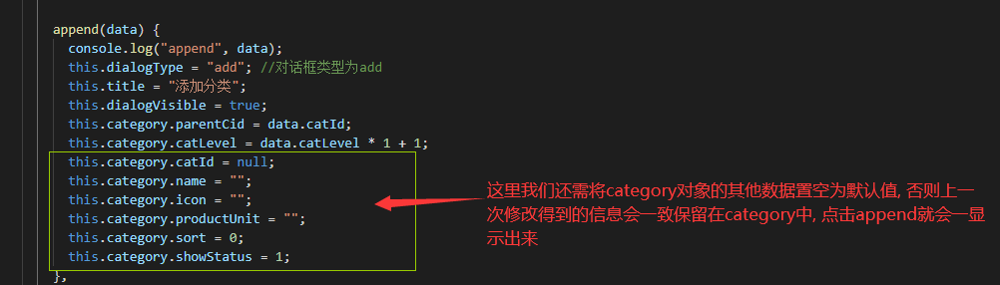


- 按照点击的按钮不同显示不同的提示操作信息


- 修改-->输入信息-->点击确定


- 修改的SQL


### P54 修改 拖拽效果

- 可拖拽结点

https://element.eleme.cn/#/zh-CN/component/tree


## 品牌管理


- 阿里云OSS存储

https://github.com/alibaba/aliyun-spring-boot/tree/master/aliyun-spring-boot-samples/aliyun-oss-spring-boot-sample

- OSS starter依赖

```xml

```

- OSS对象存储上传服务

  1. 引入OSS starter 依赖

     1. ```xml
        <dependency>
            <groupId>com.alibaba.cloud</groupId>
            <artifactId>spring-cloud-starter-alicloud-oss</artifactId>
            <version>2.1.0.RELEASE</version>
        </dependency>
        ```

  2. 配置 key secret endpoint

     1. 

  3. Autowired引入OSSClient

     1. 


- 后端签名后前端直传服务器

https://help.aliyun.com/document_detail/91868.htm?spm=a2c4g.11186623.2.10.bf997d9cAFK16w#concept-ahk-rfz-2fb


## SPU&SKU


